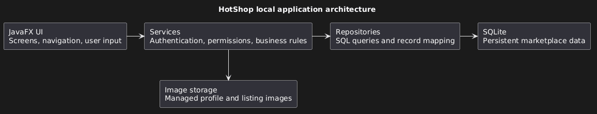
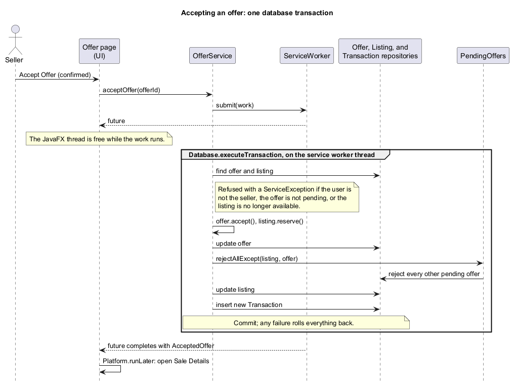
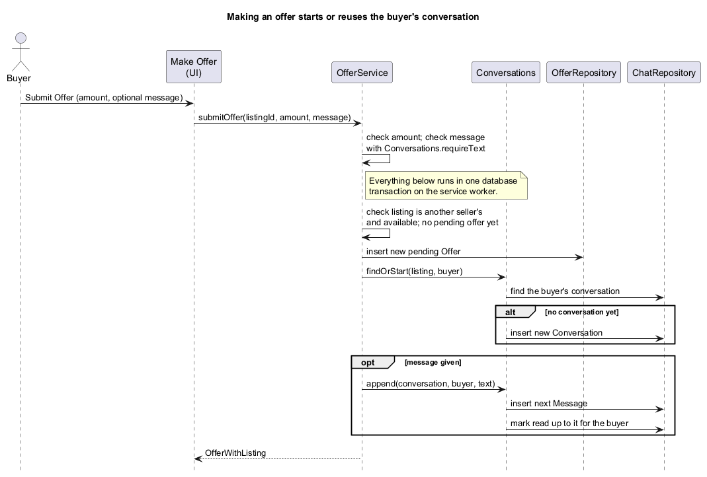
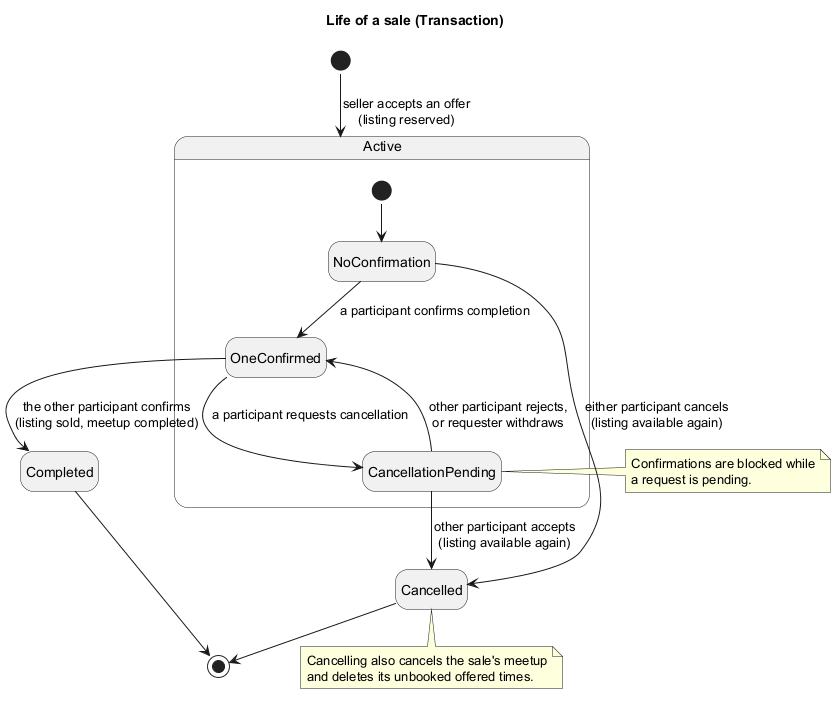

# HotShop Developer Guide

## Setup

Use JDK 25 and the included Gradle 9.1.0 Wrapper. Set JAVA_HOME to your JDK if
necessary. Import the root directory as a Gradle project in your IDE.

```powershell
.\gradlew.bat run
.\gradlew.bat test checkstyleMain checkstyleTest
.\gradlew.bat check build shadowJar
```

Use `./gradlew` on macOS/Linux. Initial dependency resolution requires network access.

### Diagrams

The five diagrams of sales, offers, and meetups (the `*_uml.puml` files) are
PlantUML sources in `docs/diagrams/`, committed next to the PNGs the guide shows. After
editing a source, regenerate its PNG with the PlantUML jar (1.2026.8, from the
[PlantUML releases](https://github.com/plantuml/plantuml/releases)) placed in the
git-ignored `tools/` folder:

```powershell
java -jar tools\plantuml.jar -tpng -charset UTF-8 docs\diagrams\sale_models_uml.puml
```

The class and state diagrams use PlantUML's built-in Smetana layout, so Graphviz
is not needed. Commit the `.puml` and the regenerated `.png` together.

## Structure

- `src/main/java/hotshop/Launcher.java`: executable JAR entry point.
- `src/main/java/hotshop/Main.java`: JavaFX lifecycle and marketplace startup.
- `src/main/java/hotshop/ui/`: application shell, feature screens, and shared presentation controls.
- `src/main/resources/hotshop/`: application stylesheet.
- `src/main/java/hotshop/model/`: shared buyer/seller domain models and supporting types.
- `src/test/java/hotshop/`: JUnit 5 model behaviour and boundary tests.
- `config/checkstyle/checkstyle.xml`: executable style checks.
- `docs/`: guides and GitHub Pages source.
- `logs/`: agent interaction records.
- `release/HotShop.jar`: generated distribution, ignored by Git.

This is a single-project, non-modular build. Launcher is separate from the
Application subclass so the bundled JAR can launch JavaFX from the classpath.
The shared model layer, AccountService, ListingService, OfferService,
TransactionService, MeetupService, and ChatService are implemented, including
SQLite persistence, authentication, profile and listing images, buyer listing
search, offers, sale completion and cancellation, sales and purchase history,
meetup slots and bookings, conversations and messages, the sales dashboard
summary, and lifecycle initialization. The account, profile, listing/search,
offer, sale, seller-dashboard, conversation, and meetup screens now call those
services. Wishlists remain deferred; their UI entry points are disabled.
Notifications were dropped from this release on 2026-09-25, so there is no
NotificationService and no Notifications sidebar entry. Users learn about
events from next steps, list ordering, pending-offer counts, and conversation
unread counts instead.

## Architecture overview

HotShop runs locally in one process. `Main.init` opens `ApplicationRuntime` before
`Main.start` creates `MarketplaceUi`. Feature page classes build JavaFX controls
and handle their actions; there is no separate controller package in the current
implementation.

[](diagrams/architecture_uml.png)

| Layer | Current components | Responsibility |
| --- | --- | --- |
| UI | `MarketplaceUi`, feature pages, `UiPage` | Navigation, forms, presentation validation, and asynchronous feedback. |
| Service | `AccountService`, `ListingService`, `OfferService`, `TransactionService`, `MeetupService`, `ChatService` | Authentication, permissions, business rules, and atomic operations. |
| Repository | `UserRepository`, `ListingRepository`, `OfferRepository`, `TransactionRepository`, `MeetupRepository`, `ChatRepository` | Execute SQL using a supplied connection and map records to models. |
| Database | `Database`, SQLite JDBC, `marketplace.db` | Connections, migrations, commit/rollback, and local persistence. |

Services also use Java models to enforce domain invariants. `ImageStorage` manages
files separately from SQLite; profile and listing image helpers coordinate file
imports and cleanup with saved references. UI image-path resolution goes through
the runtime rather than repositories.

`ApplicationRuntime.open` acquires the data-directory lock, migrates the database,
creates separate profile/listing image stores, and constructs the repositories
and six services. All services share one `Database`, `ServiceWorker`, and
`AuthenticatedSession`; time-dependent services share the supplied clock. Startup
recovers managed images before returning. Closing the runtime drains accepted
worker operations before releasing the lock. The session is in memory and starts
logged out on each launch.

## Dependencies and checks

JavaFX 25.0.2 uses controls and FXML through OpenJFX Gradle plugin 0.1.0.
JUnit Jupiter 5.13.4 is configured with the JUnit Platform launcher.
Checkstyle 12.3.1 enforces mechanical SE-EDU conventions; semantic naming and
clarity still require review. Shadow 9.2.2 bundles runtime dependencies.
Native access is enabled in Gradle launch scripts and the JAR manifest for JavaFX.

Model tests cover validation boundaries, lifecycle transitions, immutable
snapshots, and cancellation permissions/history. For a targeted run, use
`.\gradlew.bat test --tests hotshop.model.TransactionTest`.

## JavaFX UI

[UI Design Scope](UiDesignScope.md) records the confirmed screen and interaction
specification. `MarketplaceUi` installs the scene, grouped sidebar, navigation
history, session reset, and unsaved-change guards. Feature page classes construct
JavaFX controls programmatically; the old welcome-only FXML resource was removed.
No new library is required.

[](diagrams/ui_shell_uml.png)

The shared `hotshop/styles.css` defines the warm light palette and shadow-free
control states. Form and confirmation dialogs attach the same stylesheet to their
dialog panes; the startup-error dialog also uses it. Keep popup and keyboard-focus
styles consistent when adding controls. `ListingCards` fixes buyer cards at
240 x 304 and My Listings cards at 240 x 432 layout units, preserving the
208 x 130 image frame and 52-unit title area. The wrapping grid changes
column count instead of stretching cards. Existing owner-listing responses supply
the status and pending-offer footer, while buyer cards show condition.
Chat unread badges, offer-bar borders, and message bubbles reuse the shared
palette variables so conversation screens stay consistent with the theme.

`UiPage` owns loading, duplicate-submission protection, retry, and safe error
display. It uses service futures and `Platform.runLater`; it never blocks the FX
thread on a service future. Page callbacks verify that their page is still current.
Service operations run through the shared [ServiceWorker](#service-worker). Screens use
services exclusively, and service permissions remain authoritative. Confirmation
dialogs are closed before business operations start; no database transaction waits
for user input.

`UiPage.load` offers Retry after an asynchronous failure; `perform` does not
automatically offer to repeat a mutation. Both ignore duplicate submissions while
busy, disable the page body, and schedule completion handling through
`Platform.runLater`. Once back on the FX thread, the page checks
`MarketplaceUi.isCurrent` before rendering. `MarketplaceUi.canLeave` blocks
navigation while busy and asks for confirmation if the page's dirty predicate is
true. Listing editors include photo order in that predicate; profile text and
conversation drafts supply their own predicates.

`SearchState` separates submitted criteria from draft controls and retains raw
unfinished price text and scroll position across navigation. Sort changes apply
to submitted results; refresh does not submit draft edits. Session changes clear
search and navigation history. A collapsible Filters panel keeps results reachable
at the minimum window size.

### Chat screens

[Chat Screens Design](ChatScreensDesign.md) records the agreed layout and
behaviour. `ChatPages` holds the Conversations list and the entry points
(`withSeller`, `withBuyer`, and opening from the list). `ConversationPage` is one
conversation: header, offer bar, messages, and send box. It keeps its `TextArea`
across reloads, so a draft survives offer actions, and marks itself dirty while
the draft is not blank. It is the only page built with `MarketplaceUi.fixedPage`,
which is not wrapped in the page scroll pane: `UiPage.fillHeight` lets the body
take the remaining height, and only the message list scrolls, with a 200 px
minimum. `UiPage.setHeadingExtras` places controls on the title's row.

`OfferBar` is a pure record that maps the viewer's role, the latest offer, the
listing status, and the sale status to the bar's text and `OfferBar.Action`s, so
its rules are tested without JavaFX (`OfferBarTest`). For example, after an
accepted offer's sale is cancelled, the buyer gets Make Offer again once the
listing is available. The actions call
OfferService through `OfferPages.makeOffer` and `OfferPages.accept`, which the
listing page also uses. `ConversationSummary` carries only an active sale's ID,
so for an accepted offer without one the page finds the sale's status in
`getMySales` or `getMyPurchases`, as `SalePages.forOffer` does. The list's two
groups use `ConversationSummary.isAboutOfferOrSale`, which ChatService also
orders by, so the screen never restates that rule.

`UiPage.load` ignores a call while another load runs, so a page that needs two
loads chains the second inside the first's success callback. Listing details
does this when "Chat with seller" must check `getConversations` for a closed
listing; it deliberately avoids `openChatWithSeller`, which marks a conversation
read. `MarketplaceUi` refreshes the sidebar's unread total after every
navigation. The single service worker runs that count after the page load just
queued, so a conversation the new page opens is already counted as read.

### Meetup screens

[Meetup Screens Design](MeetupScreensDesign.md) records the agreed behaviour.
The conversation keeps one fixed bar for the latest stage of the deal:
`MeetupBar.replacesOfferBar` decides that an active or completed sale shows the
meetup bar instead of the offer bar. `MeetupBar` is a pure record, like
`OfferBar`: it maps the viewer's role, the `MeetupSummary`, the sale status, and
the current time to the bar's text and `MeetupBar.Action`s, and provides
`summary` (the one line on sale and listing entries) and `format` (weekday,
24-hour clock). A meetup counts as past once its end is no longer after now,
matching `SaleProgress`. Both take a `ZoneId`, so `MeetupBarTest` does not depend
on the machine's time zone.

The screens read the meetup limits from their owners rather than copying them:
`MeetupService.MAX_OFFERED_SLOTS`, `MeetupService.MAX_DAYS_AHEAD`, and
`MeetupTime.MAX_LOCATION_LENGTH`. The offer bar uses `UiControls.bar`; the
meetup bar uses a wrapping summary and action row in `MeetupPages`.

`MeetupPages` builds the bar and owns the dialogs: the time dialog (date picker
limited to today through 60 days ahead, 15-minute start times, fixed lengths,
place) and the offered-times list with Book or Withdraw. Every action calls
MeetupService and then reloads the conversation. For an active sale the page
loads `getMeetupSummary`; for a completed sale it uses the `MeetupSummary` on the
matching `SaleForParticipant`. Sale Details shows the bar's text for an active
sale; My Sales and My Purchases show
`MeetupBar.summary`; and the Dashboard shows
`SalesDashboard.upcomingMeetups`. There is no separate meetup page or sidebar
entry: meetups are always arranged inside the sale's conversation.
Seller cards reserve a 120-unit meetup area below the status/offer-count footer,
so a seller card is the compact card's height plus that area and its gap
(`ListingCards.SELLER_CARD_HEIGHT`). `ListingCards` reads the existing
`MeetupSummary` directly and shows booked dates (two lines overnight), 24-hour
times, and a 40-unit two-line place label. Only the place can truncate. The date
and time text comes from `MeetupBar.dates` and `MeetupBar.clockRange`, so cards,
sales, and the conversation bar format meetups in one place. The grid computes
row height from its fixed-size children. Colours shared across the stylesheet are
`-hotshop-*` tokens defined on `.root`.

`ChatPages` gives each conversation card a focusable body with Enter/Space
activation and a plain title. View Listing and profile buttons remain separate
focus targets; the body's event handlers exclude descendant buttons. Both
conversation groups share this presentation and retain service ordering.

`SalePages` places item context and sale progress in a `GridPane`. At 720 units of
available content width the groups use equal columns; below that they stack.
The enclosing page scrolls, preserving all sale actions and confirmation flows.
The navigation ScrollPane fits its content to height while retaining the links'
preferred minimum height for scrolling, and its viewport has a white background.
The conversation's meetup bar places its wrapping full summary above a wrapping
action row, so long places do not truncate the summary or the action buttons.

`ListingService.getPublicListings(UUID)` requires login and returns only the
selected user's available listings, newest first, with restricted public-profile
data. Missing users return NOT_FOUND; null IDs return VALIDATION. It reuses the
existing seller query, with no schema changes. `ApplicationRuntime` exposes bounded
image-path resolution for presentation; `ImageStorage.validateImage` lets the
picker validate without importing, while saving revalidates and imports as before.

UI tests use JUnit 5 and actual JavaFX controls backed by temporary SQLite data.
They require a graphical desktop; on headless Linux, install Xvfb and JavaFX's GTK
runtime libraries and run `xvfb-run -a ./gradlew test`. CI uses Xvfb. Run the screen
journeys alone with `.\gradlew.bat test --tests hotshop.ui.MarketplaceUiTest`, or
the offer and meetup bar rules with `--tests hotshop.ui.OfferBarTest --tests
hotshop.ui.MeetupBarTest`.
The tests also write scene snapshots to ignored `build/ui-checks/` for visual
inspection. Window defaults are 1100 x 750, minimum 960 x 640, in JavaFX units.

## Service worker

`ServiceWorker` serializes service operations away from the JavaFX application
thread. `ApplicationRuntime` creates one worker and supplies it to all six
services, together with the shared `AuthenticatedSession`. The worker owns a
single-thread executor named `hotshop-services`; it does not contain business
rules or manage database transactions. Services perform validation and permission
checks inside their submitted operations and use `Database` for commit/rollback.

### Submission and execution

1. A service passes a `Callable<T>` to `submit`. The worker creates a
   `CompletableFuture<T>`, queues the callable, and returns the future without
   waiting for the operation to finish.
2. The executor runs accepted operations one at a time. Session reads and changes
   use this same queue. For example, a profile update queued before logout checks
   and uses the logged-in identity before logout clears it.
3. When the callable returns, the worker completes its future with the result.
   If it throws an `Exception`, the worker completes that future exceptionally;
   the failure does not prevent subsequent queued operations from running.

Queue ordering prevents service operations from overlapping, but does not replace
database transactions: a service must still group related writes atomically.
Keep operations short, since a slow operation delays every service behind it.
Never wait for user input inside an operation.

### Completion and UI handoff

The following sequence follows a UI request through the service queue and back
to the page. `UiPage` handles presentation; `ServiceWorker` only executes the
callable and completes its future.

[](diagrams/service_worker_uml.png)

Completion callbacks can run on the service worker. `UiPage` therefore uses
`Platform.runLater` to handle the result on the FX thread, clears its busy state,
and checks that it is still the current page before displaying a result or error.
The worker itself never updates controls or retries an operation. The page offers
Retry for a failed load; it does not automatically repeat a mutation.

Do not call `join()` or otherwise wait for another service operation from a
worker callback: the queued operation cannot run until the current work releases
the worker. Do not close the runtime from that callback either. Cancelling the
returned future does not remove or interrupt its queued callable, so cancellation
must not be treated as undoing a write.

### Shutdown

`ServiceWorker.close()` closes the executor and waits for accepted operations to
finish. `ApplicationRuntime.close()` does this before releasing the data-directory
lock, so a second instance cannot open the directory while accepted work is still
running. Shutdown belongs to the application lifecycle owner. A submission
rejected by the closed executor returns a future completed exceptionally with
`ServiceException.Code.SESSION` and the message "HotShop has closed".

Existing tests cover session queue ordering in
`AccountServiceTest.updateProfile_queuedBeforeLogout_usesIdentityInQueueOrder`
and draining/rejection in
`ApplicationRuntimeTest.close_queuedRegistration_drainsWorkAndRejectsNewOperations`.

## Shared models

[AccountService Design](AccountServiceDesign.md) records the approved persistent
account requirements and implementation scope.

[Buyer Model Design](BuyerModelDesign.md) records the approved requirements;
[CONTEXT.md](../CONTEXT.md) defines the domain vocabulary.

- `User` is an immutable identity/profile with no credentials or assigned roles.
  Optional profile image and preferred location are null at construction and
  exposed through `Optional`. Username spelling is preserved; use
  `getNormalizedUsername()` for case-insensitive uniqueness checks.
- `ListingDetails` is an immutable value containing the sale terms. `Listing`
  validates and replaces details/images together. `update` returns true only
  for actual changes, signalling that a service must reject pending offers.
- `ListingImage` belongs to its containing listing; it has a relative filename
  and display order. Its containing listing supplies the listing ID for future
  persistence. Supply images in contiguous zero-based display order. Lists are
  defensively copied and read-only. Relative names use forward slashes and
  exclude empty, dot, traversal, drive, backslash, and control-character segments.
  Models do not read image files or verify their existence.
- `Offer` validates availability and ownership at creation, then stores IDs.
  Amounts are fixed; `accept`, `reject`, and `withdraw` close a pending offer.
- `Transaction` is created from an accepted offer and its reserved listing.
  It copies the agreed amount and listing title, description, and condition.
  It stores IDs rather than retaining the mutable listing/offer. It manages
  confirmations, direct cancellation, and cancellation requests.
- `CancellationRequest` is an immutable snapshot managed through its owning
  transaction. Request IDs are required when resolving requests, so a stale
  response cannot accidentally resolve a newer request. Returned history is
  immutable and retains all resolved requests.

IDs are UUIDs generated at creation. `User.restore` provides validated restoration
and immutable profile replacement with the original UUID; `Listing.restore` does
the same for listings, including status and timestamps, and `Offer.restore` for
offers (`closedAt` is present exactly when the offer is no longer pending).
`Transaction.restore` takes a `Transaction.Snapshot` (one component per saved
column plus the request history) and rejects histories the live model could
never produce; `CancellationRequest.restore` restores one request.
`Transaction.cancel` records who cancelled and when; an accepted request records
its requester as the canceller. `hasConfirmation`, `hasConfirmed`, and
`getPendingCancellation` answer the state questions services and screens ask.
Offer amounts share the listing price cap. Amounts are
positive `long` values in SGD cents. Text is stripped of surrounding whitespace;
length limits count Unicode code points. Missing required references throw
`NullPointerException`, invalid values/actors throw `IllegalArgumentException`,
and forbidden lifecycle operations throw `IllegalStateException`. Failed
operations leave model state unchanged.

`Listing` has a fixed `createdAt` and an `updatedAt` that advances only when
`update` reports an actual change; status changes never touch it. Listing prices
are capped at `ListingDetails.MAX_PRICE_CENTS` (S$1,000,000). `isDeletable` is
true only for available or archived listings.

Listing creation and updates, offer creation and closing (`accept`, `reject`,
`withdraw`), transaction creation, and timestamped operations take an explicit `Instant`.
Pass times from the service clock; operations must not precede the transaction's
last recorded event. Tests use fixed times without sleeping.

### Service integration responsibilities

These mutable models are intended for serial access, consistent with the
architecture's single background worker. They do not authenticate callers,
query other records, persist changes, or provide database transactions.

Future services must obtain actor IDs from the authenticated session and:

1. Authorize listing and offer operations and recheck listing availability.
2. Enforce username uniqueness and at most one pending offer per buyer/listing.
3. Accept an offer, reserve its listing, reject competing offers, and create a
   transaction atomically. Construct `Transaction` after acceptance/reservation.
4. Reject pending offers after an actual listing edit or archival. Done by
   ListingService through `PendingOffers`; `deleteListing` refuses listings with
   offer history and deletes their enquiry conversations in the same transaction.
5. Mark the listing sold after transaction completion, or release it after
   direct/mutually agreed cancellation, in the same persistence transaction.
   Done by TransactionService, which also closes the sale's meetup through `SaleMeetups`.
6. Preserve listing/offer/request history and exclude archived listings from browsing.

`Transaction` itself enforces participant membership, one pending cancellation
request, which participant may resolve it, and blocked completion while pending.
An actor ID passed by a model caller is still not proof of authentication.

## Account service and local persistence

`ApplicationRuntime.open(Path)` owns the application data-directory lock, schema
migration, image recovery, shared service worker, and all six services. Close it to
drain queued work before releasing the lock. `Main.init` opens the runtime off the
JavaFX thread; `Main.stop` closes it. Initialization failures show an error instead
of resetting storage. Runtime data defaults to `${user.home}/.hotshop`; override it
for development with `-Dhotshop.dataDir=/absolute/path` before `-jar`, for example:

```powershell
java "-Dhotshop.dataDir=C:\HotShop-test-data" -jar release/HotShop.jar
```

The current Gradle `run` task does not forward this system property to its
application JVM. The default Windows folder is normally `%USERPROFILE%\.hotshop`.
For an intentional clean test dataset, close the app, back up any data to retain,
and delete the selected data folder; the next launch initializes an empty one.

SQLite JDBC 3.53.4.0 is the only new library. The bundled driver supplies SQLite;
no server or separately installed SQLite executable is needed. Tests enable native
access just like the launcher. The runtime directory contains `marketplace.db`,
`application.lock`, `images/profiles/`, and `images/listings/`.

`Database.executeTransaction` opens a connection with foreign keys and a 5000 ms busy
timeout, then commits or rolls back the callback. Pass that same connection to
every repository participating in a business operation. `UserRepository` maps
profiles and separate `PasswordHash` records; it does not authorize callers.
Schema version 1 lives in `src/main/resources/db/migration/001_accounts.sql`.
Version 2 (`002_listings.sql`) adds `listings` and `listing_images` and rebuilds
`image_cleanup` with a `namespace` column, tagging existing rows as `profiles`.
Version 3 (`003_offers.sql`) adds `offers`, with a partial unique index allowing
one pending offer per buyer and listing, and `transactions`, with a partial
unique index allowing one active sale per listing. Version 4
(`004_sale_completion.sql`) adds `cancelled_at` and `cancelled_by` to
`transactions` and a `cancellation_requests` table with a partial unique index
allowing one pending request per sale. `Transaction`'s internal `lastEventAt` is
not stored; `restore` derives it from the saved times. Requests are saved with an
upsert and read back in the order they were made, so the latest is always last.
Version 5 (`005_meetups.sql`) adds `meetup_slots`, `meetups`, and
`meetup_reschedule_proposals`, with partial unique indexes allowing one scheduled
meetup per sale and one pending move proposal per meetup.
Version 6 (`006_conversations.sql`) adds `conversations` (unique per listing and
buyer, with each participant's read position and last-opened time) and
`messages` (unique per conversation and sequence number). It also creates a
conversation for every buyer and listing that already had offers, marked as
opened by both at the latest offer event so old offers don't show as unread.
Before the Chat-Service branch was rebased onto MeetupService, this migration
ran as version 5; delete any local database created from that branch then.

### Schema migrations

`Database.migrate` runs at every startup. It reads the database's highest
recorded version from `schema_migrations`, then applies each later migration
in order, each in its own transaction together with its version record. A
failure therefore leaves the database at the last fully applied version, and
the next startup retries from there. A database whose version is higher than
the application knows is refused rather than downgraded.

To change the schema:

1. Add `src/main/resources/db/migration/NNN_description.sql`, numbered one
   above the latest file.
2. Append its resource path to `Database.MIGRATIONS`. A migration's version is
   its one-based position in that list, so only ever append.
3. Add tests that open a database created at the previous version and check
   that existing data survives the upgrade.

Never edit or reorder a migration that has been merged, and never reset an
existing database; change the schema with a new migration instead. If both
teammates add a migration on separate branches, whoever merges second
renumbers theirs. Statements are split on `;`, so migrations must not contain
triggers or semicolons inside string literals or comments.

`DatabaseTest` supplies its own migration files from
`src/test/resources/db/test-migration/` through a package-private constructor,
so runner tests do not depend on the released schema.

### Account operations and authentication

AccountService returns `CompletableFuture` results. Its public operations are
`register`, `login`, `logout`, `getCurrentUserId`, `getOwnProfile`, `getPublicProfile`,
`updateProfile`, `changePassword`, `replaceProfileImage`, and `removeProfileImage`.
`recoverImages` is a lifecycle maintenance operation. Access the service through
`ApplicationRuntime.getAccounts()`. `ServiceException.getCode()` distinguishes
validation, authentication, session, duplicate username, not-found, storage,
permission, and invalid-state failures for every service; a joined future wraps
the exception in `CompletionException`.

Future services must share the same `ServiceWorker`, `AuthenticatedSession`, and
`Database` when wired into ApplicationRuntime. Resolve acting identity inside the
queued operation, not when a controller submits it. The session contains only
the UUID; profile reads use the latest persisted record. PublicProfile includes
only ID, display name, and optional image filename. Private pickup preferences
and credential records must never be passed to another user's profile screen.
Callbacks may execute on the service worker; marshal UI updates using
`Platform.runLater`. Do not block that worker by joining another service call or
closing the runtime from a completion callback. Closing belongs to the lifecycle
owner. Cancelling a returned future does not cancel an already queued mutation.

[](diagrams/accounts_uml.png)

Passwords use PBKDF2-HMAC-SHA256, a fresh 16-byte salt, 600,000 iterations, and a
256-bit derived key, with algorithm/work-factor metadata persisted separately.
Password strings are not normalized or stripped. No password/hash is returned
through a profile. A local database is not protection against someone who can
modify the application's data files; there is no remote authentication server.

The login sequence shows credential verification inside the database transaction
and session establishment only after successful verification.

[](diagrams/login_uml.png)

ImageStorage accepts per-feature limits and validates actual JPEG/PNG contents,
dimensions, and bounded bytes before writing a generated filename. `ManagedImages`
owns one image namespace (a folder, its limits, a "still referenced" query, and
its rows in the durable `image_cleanup` queue). It imports files, queues retired
files inside the caller's transaction, and recovers orphans. `ProfileImages` and
`ListingService` each configure one (`profiles` and `listings`), so recovery in
one namespace never processes or deletes the other's files. Cleanup rechecks
database references and retries failed removals at startup. A new image feature
should add a namespace to the `image_cleanup` CHECK constraint in a migration
and construct its own `ManagedImages`. SQL fixtures/triggers
in tests inject persistence failures at the external database boundary; assertions
check service-visible results and managed-file lifecycle.

## Marketplace services

Five services carry the marketplace rules: ListingService, OfferService,
TransactionService (sales), MeetupService, and ChatService. Each is reached
through `ApplicationRuntime` (`getListings()`, `getOffers()`, `getTransactions()`,
`getMeetups()`, `getChats()`), shares the one `ServiceWorker`, database, and
session described above, and follows the same pattern:

- Every operation requires login and acts as the session's current user.
  Screens never pass a user ID, so a screen cannot act for someone else.
- Each change runs in one database transaction. It loads the records, checks
  who may act and what state allows, applies the change through the model, and
  saves every affected record before committing. Any failure rolls the whole
  change back.
- Refusals are `ServiceException`s whose codes say why (`VALIDATION`,
  `NOT_FOUND`, `PERMISSION`, `INVALID_STATE`, `SESSION`, `STORAGE`) and whose
  messages say what to do, with real values, never SQL. Tests assert the code
  and key values, not exact wording.
- Results are detached copies, often paired with public profiles
  (`ListingWithSeller`, `SaleForParticipant`, `ConversationSummary`), so screens
  cannot change stored state by accident.

`ServiceSupport` holds the plumbing these five share: the current time
truncated to SQLite's milliseconds, transaction error mapping, public-profile
lookup, status words, price formatting (`S$40.00`), and message times on a
24-hour clock. Small package-private helpers let one service change another's
records inside its own transaction, without queueing more work on the single
worker: `PendingOffers` (reject a listing's pending offers), `SaleMeetups`
(load and close a sale's meetup), and `Conversations` (start a conversation and
add messages).

The models behind these services, and how they refer to each other:

[](diagrams/sale_models_uml.png)

Records refer to each other by ID rather than holding each other, so each can
be loaded and saved on its own. A sale (`Transaction`) copies the agreed price
and the listing's title, description, and condition, so a later listing edit
never changes it. `MeetupTime` is one value for a start, end, and place,
validated once (15 minutes to 4 hours, a 1-200 character place) and shared by
offered times, meetups, and move proposals.

## Listing service

ListingService manages a seller's listings and buyers' search. Design:
[ListingService Design](ListingServiceDesign.md).

| Operation | Who and when |
| --- | --- |
| `createListing(draft, photos)` | Any user; saves an available listing they own. |
| `updateListing(id, draft, photos)` | The owner, while available. |
| `archiveListing(id)` | The owner, while available or sold. |
| `deleteListing(id)` | The owner, while available or archived, with no offer history. |
| `getMyListings()` | The current user's listings as `OwnListing`: reserved, available, sold, archived, each newest first, with the pending-offer count and, for reserved listings, the meetup summary. |
| `getPublicListings(sellerId)` | Any user; a profile's available listings, newest first. |
| `getListing(id)` | Any user; any existing listing in any status. |
| `searchListings(search)` | Any user; other sellers' available listings only. |

Design decisions:

- **Photos are saved before the database write, and cleaned up on failure.**
  A save takes the complete ordered photo list (`ListingPhoto.keep` and
  `ListingPhoto.add`, 0 to 10, JPEG/PNG up to 10 MiB and 4096 px per side).
  New files are imported first; if the transaction then fails, recovery removes
  the copies that were never saved, and removed photos are only deleted after
  commit.
- **An actual edit or an archive rejects the listing's pending offers** in the
  same transaction (`PendingOffers`), because buyers offered on the old details.
  `Listing.update` reports whether anything really changed, so saving without a
  change keeps the offers.
- **Search filters and sorts in Java, not SQL.** SQL selects other sellers'
  available listings; `ListingSearch` then applies the title, category,
  condition, and price filters and the sort, because SQLite's case-insensitive
  matching only covers ASCII letters. There is no pagination.
- **Deleting keeps history safe.** A listing with offer history cannot be
  deleted; the refusal tells the seller to archive it instead. Its enquiry
  conversations (buyers who messaged but never offered) are deleted with it, and
  the screen warns how many.

## Offer service

OfferService handles buyers' offers and the seller's decisions. Design:
[OfferService Design](OfferServiceDesign.md).

| Operation | Who and when |
| --- | --- |
| `submitOffer(listingId, amountCents[, message])` | A buyer, on another seller's available listing, with no pending offer on it. The message is optional. |
| `withdrawOffer(offerId)` | The offer's buyer, while pending. |
| `getMyOffers()` | A buyer's offers in every status, newest first. |
| `getOffersForListing(listingId)` | The listing's seller: the live sale's offer, then accepted offers whose sale was cancelled, then the rest newest first. |
| `acceptOffer(offerId)` | The listing's seller, for a pending offer on an available listing. |
| `rejectOffer(offerId)` | The listing's seller, for a pending offer. |

Design decisions:

- **Accepting is one transaction.** It accepts the offer, reserves the listing,
  rejects every other pending offer, and creates the sale together, so a buyer
  can never see an accepted offer without a sale, or two sales for one listing
  (the database also allows only one active sale per listing).
- **Amounts never change.** To change an amount, the buyer withdraws and offers
  again; the database allows one pending offer per buyer and listing.
- **Every offer starts or reuses the buyer's conversation** (through
  `Conversations`), in the same transaction, so the seller can always reply to
  anyone who offered. An optional message becomes the conversation's next
  message.
- **Accepted offers carry their sale's status** (`OfferWithListing`,
  `OfferWithBuyer`), so screens can show "Accepted · Sale Cancelled" without a
  separate offer status. After a sale is cancelled, the listing can receive new
  offers.

The first diagram follows accepting an offer through its single transaction; the
second shows how making an offer starts or reuses the buyer's conversation.

[](diagrams/accept_offer_uml.png)

[](diagrams/make_offer_uml.png)

## Transaction service

TransactionService runs an agreed sale from acceptance to completion or
cancellation, and builds My Sales, My Purchases, and the seller dashboard.
Design: [TransactionService Design](TransactionServiceDesign.md).

| Operation | Who and when |
| --- | --- |
| `confirmCompletion(saleId)` | Either participant, while active, with no pending request, once each. The second confirmation completes the sale. |
| `cancelSale(saleId)` | Either participant, while active and before anyone has confirmed. |
| `requestCancellation(saleId)` | Either participant, after a confirmation, when no request is pending. |
| `acceptCancellation(saleId)` / `rejectCancellation(saleId)` | The participant who did not make the pending request. |
| `withdrawCancellation(saleId)` | The participant who made the pending request. |
| `getMySales()` / `getMyPurchases()` | One `SaleForParticipant` per sale: those waiting on a cancellation response first, then other active, completed, and cancelled, each newest first. |
| `getSalesDashboard()` | The seller's pending offers received, active and completed sale counts, the total of completed sales, and upcoming meetups. |

Design decisions:

- **Actions take only the sale ID.** A sale has at most one pending
  cancellation request, so accept, reject, and withdraw always act on it; a
  stale screen cannot answer an older request.
- **One path for every change** (`applyToActiveSale`): load the sale, check the
  participant and that it is active, apply the change through the `Transaction`
  model, and save the sale, its listing (sold or available again), and its
  meetup together.
- **Screens are told what to do next.** `SaleProgress` turns a sale into the
  viewer's `NextStep` (with its display text), the `SaleAction`s they may take,
  and its place in the list, using the same model queries as the rules. Screens
  never offer an action the service would refuse.
- **The sale decides the meetup's outcome.** Completing a sale completes its
  meetup and cancelling it cancels the meetup, in the same transaction
  (`SaleMeetups`), so the two can never disagree.

The sale's states, and what each participant can do in them:

[](diagrams/sale_state_uml.png)

## Meetup service

MeetupService arranges when and where an active sale's buyer and seller hand
over the item. Design: [MeetupService Design](MeetupServiceDesign.md).

| Operation | Who and when |
| --- | --- |
| `offerSlot(saleId, start, end, location)` | The seller, while the sale is active and no meetup is booked; at most 3 future times at once. |
| `withdrawSlot(slotId)` | The seller of the time's sale. |
| `bookSlot(slotId)` | The buyer, for a future offered time. The sale's other offered times are deleted. |
| `proposeMove(meetupId, start, end, location)` | Either participant, when no move is pending. |
| `acceptMove(meetupId)` / `rejectMove(meetupId)` | The participant who did not propose. |
| `withdrawMove(meetupId)` | The participant who proposed. |
| `cancelMeetup(meetupId)` | Either participant; the sale stays active. |
| `getMeetupSummary(saleId)` | Either participant: future offered times and the current meetup (scheduled, else completed). |

Design decisions:

- **Offered times belong to one sale**, not to a seller's general
  availability, so booking one can safely delete the rest.
- **No double bookings.** Offering a time checks the seller's other scheduled
  meetups; booking, proposing a move, and accepting a move check both
  participants', whether they are buying or selling in them. The same time can
  be offered to two buyers, and the first to book gets it.
- **"60 days ahead" counts calendar days.** A meetup may start at any time on
  or before the 60th day after today (`MAX_DAYS_AHEAD`), so an evening meetup on
  day 60 may end on day 61. Calendar days and message times use the services'
  clock zone: the production clock is `Clock.systemDefaultZone()`, which
  matches the screens, and tests use a fixed UTC `TestClock`.
- **Nothing changes by the clock alone.** A meetup whose end time has passed
  stays scheduled, and the next step asks the participants to confirm
  completion. Cancelled meetups are kept as history but not shown.
- **The summary travels with the sale.** `SaleForParticipant`, reserved
  `OwnListing` entries, and the conversation (through the active sale ID in
  `ConversationSummary`) carry the same `MeetupSummary`, and the dashboard counts
  the seller's scheduled meetups that have not started.

How a sale's meetup moves from offered times to a booked meetup, and how the
sale's outcome closes it:

[](diagrams/meetup_state_uml.png)

## Chat service

ChatService handles the conversation between one buyer and the seller about one
listing. Design: [ChatService Design](ChatServiceDesign.md).

| Operation | Who and when |
| --- | --- |
| `messageSeller(listingId, text)` | A buyer, on another seller's available or reserved listing; starts the conversation or adds to it. |
| `sendMessage(conversationId, text)` | Either participant, while the listing is available or reserved. |
| `openConversation(conversationId)` | Either participant; returns every message and marks them read. |
| `openChatWithSeller(listingId)` | A buyer; their conversation, or empty before the first message. |
| `openChatWithBuyer(listingId, buyerId)` | The listing's seller; an existing conversation only. |
| `getConversations()` | Anyone; pending offers and active sales first, then the rest; unread first, then the latest activity. |
| `getUnreadCount()` | Anyone; the total unread items, for the sidebar. |

Design decisions:

- **Only buyers start conversations**, by messaging or by making an offer, and
  there is at most one per buyer and listing. Sellers open existing ones from
  an offer or a sale.
- **Sold and archived listings keep their conversations readable** but closed
  to new messages; a cancelled sale makes the listing available, so sending
  resumes. Messages are 1-1,000 characters and cannot be edited.
- **Unread counts include offer news without an event table.** A
  conversation's count is the other participant's messages after the viewer's
  read position, plus offers that changed since the viewer last opened it: new
  and withdrawn offers for the seller, accepted and rejected ones for the buyer,
  each counted once. These come from the offers' own times.
- **No automatic messages.** Offer, sale, and meetup events never appear as
  fake messages; `ConversationSummary` carries the latest offer and the active
  sale ID, so the screen shows the live offer and meetup beside the messages.

### Testing the services

Service tests open a real `ApplicationRuntime` on a temporary folder with a
`TestClock` (`ApplicationRuntime.open(Path, Clock)`), so they use the real
database, worker, and repositories, and time only moves when a test advances it.
Some listing tests set a listing's status in SQL to reach reserved or sold states
directly; offer, sale, meetup, and chat tests use the real services.

The full test suite takes 10 to 15 minutes on our machines, mostly because each
test account's password is hashed with 600,000 PBKDF2 iterations, and the UI
tests open JavaFX windows. Run targeted checks while developing and the full
suite before committing:

```powershell
.\gradlew.bat test --tests "hotshop.service.Listing*" --tests hotshop.service.PublicListingsTest
.\gradlew.bat test --tests hotshop.service.OfferServiceTest
.\gradlew.bat test --tests hotshop.service.TransactionServiceTest
.\gradlew.bat test --tests hotshop.service.MeetupServiceTest --tests "hotshop.model.Meetup*"
.\gradlew.bat test --tests hotshop.service.ChatServiceTest --tests hotshop.model.ConversationTest --tests hotshop.model.MessageTest
.\gradlew.bat test --tests hotshop.service.AccountServiceTest --tests hotshop.service.ProfileImageTest
.\gradlew.bat test --tests hotshop.storage.ImageStorageTest
.\gradlew.bat test --tests hotshop.ApplicationRuntimeTest --tests hotshop.database.DatabaseTest
```

## Packaging and CI

`shadowJar` writes `release/HotShop.jar`. Build separately for each target OS and
architecture because JavaFX native libraries are platform-specific.
The JAR requires a separately installed Java 25 runtime.

GitHub Actions runs tests, Checkstyle, check, build, and shadowJar on pull
requests and pushes to main/master, and uploads a Linux JAR artifact.
The workflow also supports manual dispatch.

## GitHub Pages

After pushing, open repository Settings > Pages, select **Deploy from a branch**,
select the branch containing these files and **/docs**, and save.
GitHub publishes the site after its Pages build completes.
Hosting has not been enabled by this local setup.

## Engineering skills

Agent skill configuration lives in [docs/agents](agents/). It defines the
[team GitHub issue tracker](agents/issue-tracker.md),
[triage labels](agents/triage-labels.md), and
[domain documentation rules](agents/domain.md). `AGENTS.md` directs agents
to read these files when needed.

Edit these configuration files directly to adjust the workflow. Re-run
`setup-matt-pocock-skills` when switching trackers or restarting setup.
Domain documentation uses a root `CONTEXT.md` and `docs/adr/`, created by
`domain-modeling` as terminology and decisions are resolved.

The skills are installed once in `.agents/skills/`, where Codex reads them.
Claude Code reads `.claude/skills/` instead, so link that path to the same
folder rather than copying it. On Windows (no administrator rights needed):

```powershell
New-Item -ItemType Directory -Force .claude
cmd /c mklink /J .claude\skills .agents\skills
Add-Content .git\info\exclude ".claude/skills"
```

On macOS/Linux, use `ln -s ../.agents/skills .claude/skills`. The link is
excluded locally rather than committed because the repository does not enable
Git symlinks. Restart Claude Code if the skills do not appear.

## Acknowledgements

- [OpenAI Codex](https://openai.com/codex/): AI assistance with project scaffolding,
  implementation, tests, documentation, and review. The task records in
  [logs](../logs/) describe the scope and verification of individual interactions;
  generated output was adapted to this project's requirements.
- [`setup-javafx-project`](../.agents/skills/setup-javafx-project/SKILL.md):
  repository-local skill used to guide the initial JavaFX/Gradle scaffold, build
  configuration, CI, and guide structure, as recorded in the
  [scaffold log](../logs/2026-09-16-create-hotshop-javafx-scaffold.md). This link is
  the local source; no external author or upstream source is recorded here.
- [`skills/generate-report`](../skills/generate-report/SKILL.md): repository-local
  instructions and [report script](../skills/generate-report/scripts/generate_report.py)
  for turning the Codex setup JSONL log into an HTML execution report. Its scope
  is development reporting, not application runtime functionality; no external
  upstream source is recorded here.
- [JavaFX/OpenJFX](https://openjfx.io/): the application's desktop UI toolkit;
  JavaFX controls, layouts, images, CSS, and application lifecycle are used
  throughout the UI. The libraries are bundled in the platform-specific JAR.

- [Matt Pocock's engineering skills](https://github.com/mattpocock/skills)
  (`mattpocock/skills`, all 25 pinned in `skills-lock.json`): agent
  configuration adapted from the installed `setup-matt-pocock-skills`
  templates in `.agents/skills/setup-matt-pocock-skills/`. The skills'
  instructions were used unmodified to run the development process for the
  listing, offer, sale, meetup, and chat features: `grilling` and
  `domain-modeling` for the design interviews recorded in the `*Design.md`
  documents and `CONTEXT.md`, `implement` and `tdd` for building each feature
  test first, `code-review` for the two-axis standards and specification
  reviews, and `resolving-merge-conflicts` for rebases. The skills shaped the
  process only; none of their text is part of the application.
- [Claude Code](https://claude.com/claude-code) (Anthropic): AI assistance for
  the listing, offer, sale, meetup, and chat services and screens, including
  design interviews, implementation, tests, reviews, merge-conflict
  resolution, these guides, and the PlantUML diagrams in `docs/diagrams/`.
  Each session is recorded in [logs](../logs/); all output was reviewed and
  adapted to the project's requirements.

- [OpenJFX Gradle plugin](https://github.com/openjfx/javafx-gradle-plugin): dependency configuration.
- [SE-EDU Java conventions](https://se-education.org/guides/conventions/java/intermediate.html):
  basis for the Checkstyle rules.
- [SE-EDU Git conventions](https://se-education.org/guides/conventions/git.html):
  commit message format used throughout the history.
- [JUnit 5](https://junit.org/junit5/) (5.13.4): the testing framework for every
  model, service, database, and UI test, including parameterised tests.
- [PlantUML](https://plantuml.com/) (1.2026.8): renders the sale, offer, and meetup
  diagrams from their `.puml` sources in `docs/diagrams/`; see
  "Diagrams" under Setup. It is a documentation tool only and is not part of
  the build.
- [Gradle](https://docs.gradle.org/9.1.0/release-notes.html): wrapper and Java 25 build support.
- [Shadow](https://gradleup.com/shadow/): executable dependency bundling.
- [Xerial SQLite JDBC](https://github.com/xerial/sqlite-jdbc): bundled SQLite driver.
- [OWASP Password Storage](https://cheatsheetseries.owasp.org/cheatsheets/Password_Storage_Cheat_Sheet.html)
  and [Java security providers](https://docs.oracle.com/en/java/javase/25/security/oracle-providers.html):
  password-storage implementation guidance. The user-selected composition policy
  is a project requirement, not a claim of NIST compliance.

## Appendix: Requirements

### Product scope

**Target user:** people who buy and sell second-hand items with others who share
one HotShop installation (for example, a shared computer), and who hand items
over in person.

**Value proposition:** one desktop app, working offline, to list an item, agree
a price through offers, chat with the other person, arrange a handover time and
place, and record that the sale completed, instead of juggling listings,
messages, and calendars separately. Every user can both buy and sell.

### User stories

Priorities: `* * *` must have, `* *` nice to have, `*` unlikely to have or
deferred.

| Priority | As a... | I want to... | So that... |
| --- | --- | --- | --- |
| `* * *` | seller | create a listing with a price, details, and photos | buyers can find and judge my item |
| `* * *` | seller | edit an available listing | I can correct its details before anyone agrees to buy |
| `* * *` | seller | archive a listing | it leaves search but its history stays visible to the people involved |
| `* *` | seller | delete a listing nobody has offered on | I can remove a mistake completely |
| `* * *` | buyer | search other sellers' available listings by title, category, condition, and price | I find items I want quickly |
| `* * *` | buyer | make an offer, optionally with a message | the seller knows what I am willing to pay |
| `* * *` | buyer | withdraw my pending offer | I can change my mind or offer a different amount |
| `* * *` | seller | see every offer on my listing | I can compare them before deciding |
| `* * *` | seller | accept one offer | the item is reserved for that buyer and other offers are closed |
| `* *` | seller | reject an offer | the buyer knows it was declined |
| `* * *` | buyer or seller | confirm that the handover happened | the sale completes once both of us confirm |
| `* * *` | buyer or seller | cancel a sale before anyone confirms | the listing becomes available again |
| `* *` | buyer or seller | request cancellation after a confirmation, and answer the other person's request | a sale can only be undone by agreement once someone has confirmed |
| `* * *` | seller | see My Sales and a dashboard of offers, sales, and upcoming meetups | I know what needs my attention |
| `* * *` | buyer | see My Purchases with each sale's next step | I know what to do next |
| `* * *` | seller | offer the buyer up to three meetup times and places | the buyer can pick one that suits them |
| `* * *` | buyer | book one of the offered times | we have an agreed handover |
| `* *` | buyer or seller | propose moving a booked meetup, and accept or reject the other person's proposal | we can reschedule without cancelling |
| `* *` | buyer or seller | cancel a booked meetup | we can arrange a new time while the sale stays active |
| `* * *` | buyer | message the seller about a listing | I can ask questions before offering |
| `* * *` | buyer or seller | see my conversations with unread counts, offers and active sales first | I notice new messages and offer news |
| `* *` | seller | open the conversation with a buyer from their offer or sale | I can reply without searching for it |
| `*` | user | be notified when an offer, sale, or meetup changes | I don't have to check each page (not in this release: notifications were dropped for time; next steps, list ordering, and unread counts show these events instead) |

#### Wishlist user stories (future release)

Wishlist functionality is deferred: the sidebar entry and listing action are
disabled and labelled Coming soon. The following are proposed requirements,
not supported workflows or claims about the current data model.

| Priority | As a... | I want to... | So that... |
| --- | --- | --- | --- |
| `*` | logged-in buyer | save a listing to my wishlist | I can find an item I am considering again without repeating a search. |
| `*` | logged-in buyer | view my saved listings and open their details | I can compare items and check their current availability before offering. |
| `*` | logged-in buyer | remove a listing from my wishlist | I can keep only the items I am still interested in. |

### Use cases

For all use cases, the **system** is HotShop and the **actor** is a logged-in
user, unless specified otherwise. Each step that changes data is saved in one
database transaction.

#### Use case: Make an offer and have it accepted

**Actors:** buyer, seller

**Main success scenario:**

1. The buyer opens another seller's available listing and makes an offer,
   optionally with a message.
2. HotShop saves the pending offer and starts, or reuses, the buyer's
   conversation with the seller, adding the message if there is one.
3. The seller opens the listing's Incoming Offers or the conversation, and
   accepts the offer.
4. HotShop accepts the offer, reserves the listing, rejects every other
   pending offer on it, and creates an active sale.
5. HotShop shows the sale's details, and both participants see the sale's next
   step.

   Use case ends.

**Extensions:**

- 1a. The listing is the buyer's own. HotShop refuses the offer. Use case ends.
- 1b. The listing is reserved, sold, or archived. HotShop refuses the offer and
  names the status. Use case ends.
- 1c. The buyer already has a pending offer on the listing. HotShop refuses and
  shows that offer's amount; the buyer may withdraw it and resume at step 1.
- 1d. The amount is outside S$0.01 to S$1,000,000.00, or the message is over
  1,000 characters. HotShop explains the limit. Resume at step 1.
- 2a. The buyer withdraws the offer before the seller responds. The offer is
  closed as withdrawn. Use case ends.
- 3a. The seller rejects the offer. The offer is closed as rejected and the
  listing stays available. Use case ends.
- 3b. The listing was edited or archived after the offer was made. Its pending
  offers were rejected then, so there is nothing to accept. Use case ends.

#### Use case: Arrange a meetup

**Actors:** seller, buyer of an active sale

**Main success scenario:**

1. The seller offers a meetup time: a date, start time, length, and place.
2. HotShop saves the offered time and shows it in the conversation's meetup bar.
3. The buyer chooses one of the offered times and books it.
4. HotShop books the meetup and deletes the sale's other offered times.
5. Both participants see the booked meetup in the conversation, the sale, and
   the seller's listing.

   Use case ends.

**Extensions:**

- 1a. The seller already has three offered times for the sale. Offer Time is no
  longer shown until one is withdrawn or booked.
- 1b. The time is in the past, after the 60th day from today, not 15 minutes to
  4 hours long, or its place is blank or over 200 characters. HotShop explains
  the limit. Resume at step 1.
- 1c. The time overlaps one of the seller's other meetups. HotShop refuses and
  names the clashing meetup. Resume at step 1.
- 3a. The time overlaps another meetup of either participant. HotShop refuses
  the booking and names the clash. Resume at step 3.
- 5a. Either participant proposes moving the meetup to a new time and place.
  - 5a1. The other participant accepts: the meetup moves.
  - 5a2. The other participant rejects, or the proposer withdraws: the meetup
    stays as booked.
- 5b. Either participant cancels the meetup. The sale stays active. Resume at
  step 1.
- 5c. The sale completes or is cancelled. The meetup completes or is cancelled
  with it. Use case ends.
- 5d. The meetup's end time passes. It stays booked, and the next step asks
  both participants to confirm completion.

#### Use case: Cancel a sale after a confirmation

**Actors:** two participants of an active sale, one of whom has confirmed
completion

**Main success scenario:**

1. A participant requests cancellation of the sale.
2. HotShop records the pending request and blocks further confirmations.
3. The other participant accepts the request.
4. HotShop cancels the sale, cancels its meetup, and makes the listing
   available again.

   Use case ends.

**Extensions:**

- 1a. Nobody has confirmed yet. The participant cancels the sale directly
  instead. Resume at step 4.
- 1b. A request is already pending. HotShop refuses a second one. Use case ends.
- 2a. A participant tries to confirm completion. HotShop refuses while the
  request is pending.
- 3a. The other participant rejects the request. The sale continues and earlier
  confirmations stay. Use case ends.
- 3b. The requester withdraws the request. The sale continues. Use case ends.

#### Use case: Start and continue a conversation

**Actors:** buyer, seller

**Main success scenario:**

1. The buyer opens another seller's available or reserved listing and chooses
   Chat with seller.
2. The buyer writes a message and sends it.
3. HotShop starts the conversation and saves the message.
4. The seller sees the conversation with an unread count, opens it, and replies.

   Use case ends.

**Extensions:**

- 1a. The listing is the buyer's own. HotShop does not offer a conversation.
- 1b. The listing is sold or archived and the buyer has no conversation about
  it. HotShop refuses to start one.
- 1c. The buyer starts the conversation by making an offer instead. Resume at
  step 4.
- 2a. The message is blank or over 1,000 characters. HotShop refuses and keeps
  the draft. Resume at step 2.
- 4a. The listing has since been sold or archived. The conversation stays
  readable, but no new messages can be sent.
- 4b. The seller deletes a listing that only had enquiries. Its conversations
  are deleted with it, after the seller is warned how many. Use case ends.

### Non-functional requirements

1. Every change to listings, offers, sales, meetups, and conversations is saved
   in one database transaction, so a failure part-way leaves nothing half done.
2. All data operations run one at a time on a single background worker, so two
   actions never interleave and the window stays responsive while they run.
3. Only one HotShop instance can use a data folder at a time.
4. HotShop works offline; all data stays in a local folder on the computer.
5. Existing data is upgraded automatically, without loss, when a newer version
   adds database tables.
6. Every refused action explains what is wrong and what to do next, using real
   values, and never shows internal errors such as SQL.
7. Every screen stays usable at the minimum window size of 960 x 640.

### Glossary

The project's domain terms are defined in [CONTEXT.md](../CONTEXT.md). The
terms used most in this guide:

| Term | Meaning |
| --- | --- |
| Active sale | A sale that has been agreed but not yet completed or cancelled. Its listing is reserved. |
| Archive | Withdraw a listing from search while keeping it and its history visible to the people involved. It cannot be reopened. |
| Cancellation request | A participant's proposal to cancel an active sale after the first completion confirmation; the other participant must agree. |
| Completion confirmation | A participant's declaration that the sale is complete. Both must confirm. |
| Conversation | The messages between one buyer and the seller about one listing; at most one per buyer and listing. |
| Delete | Permanently remove a listing with no offer or sale history, together with its enquiry conversations. |
| Enquiry | A conversation about a listing that the buyer never made an offer on. |
| Meetup | The booked time and place where an active sale's buyer and seller hand over the item. |
| Meetup slot (offered time) | A time and place the seller offers the buyer for one sale's handover. |
| Offer | A buyer's proposal to buy a listing at a specified amount. |
| Reschedule proposal (move proposal) | A participant's proposal to move a meetup to one new time and place. |
| Transaction (sale) | An agreed sale, created when the seller accepts an offer. |
| Withdraw | Take back your own pending offer, or your own pending request or proposal. |

## Appendix: Planned enhancements

Team size: 2

These four proposals refine existing features and are not implemented in this
release. The deferred wishlist above is a future feature, not an enhancement in
this list.

1. **Show the latest offer's status on conversation cards.** Add a status label
   using the latest offer already carried by `ConversationSummary`, so users can
   inspect it without opening each conversation.
2. **Allow any meetup length from 15 minutes to 4 hours.** Replace the dialog's
   fixed duration choices with a validated duration input within the existing
   `MeetupTime` limits.
3. **Make All categories a selectable search option.** Currently it is the empty
   category prompt restored by Clear Filters. Let users remove just the category
   restriction while keeping their condition and price filters.
4. **Retain whether Filters is expanded across Back navigation.** Extend the
   existing saved search state to restore that panel's open/closed state, while
   continuing to open it automatically when a submitted price is invalid.

## Appendix: Instructions for manual testing

These steps test the listing, offer, sale, meetup, and chat features with two
accounts. They complement the [User Guide](UserGuide.md), which explains each
screen; testing of accounts, profiles, and search is covered separately.

Only one user is logged in at a time, so every "as Bob" step means: choose
**Log out**, then log in as Bob. Messages and changes made by one user appear
for the other at their next login.

### Preparing a fresh data folder

Use a separate folder so tests never touch your own data. Build the JAR, then
start HotShop on the test folder (PowerShell):

```powershell
.\gradlew.bat shadowJar
java "-Dhotshop.dataDir=$env:TEMP\hotshop-test" -jar release\HotShop.jar
```

To start again from nothing, close HotShop and delete that folder.

Register three accounts (see the User Guide's account section). Carol is only
needed for the refusal checks:

| Username | Display name | Password |
| --- | --- | --- |
| `alice` | `Alice` | `Sample1!` |
| `bobby` | `Bob` | `Sample1!` |
| `carol` | `Carol` | `Sample1!` |

### Walkthrough: from listing to completed sale

1. **As Alice, create a listing.** My Listings, then **Create Listing**: title
   `Study desk`, description `Wooden desk with one drawer`, category Furniture,
   condition Good, price `50.00`, pickup location `Library entrance`. Choose
   **Save Listing**.
   Expected: the card appears in My Listings as Available with 0 pending offers.
2. **As Bob, message the seller.** Search, open **Study desk**, choose **Chat
   with seller**. The page shows "No messages yet." and a "No offer yet" bar.
   Type `Is it still available?` and choose **Send**.
   Expected: the message appears; Conversations lists the conversation with a
   Buying badge.
3. **As Bob, make an offer with a message.** In the conversation's bar choose
   **Make Offer**, enter `40.00` and the message `Can pick up tonight`, and
   choose **Submit Offer**.
   Expected: the bar shows "Offer of S$40.00 · Pending" with **Withdraw Offer**,
   and the message appears in the conversation.
4. **As Alice, see the unread items and accept.** The sidebar shows
   **Conversations (3)**: Bob's two messages plus the new offer. Open the
   conversation, choose **Accept Offer**, and confirm.
   Expected: Sale Details opens; the listing is Reserved; Conversations now
   shows no unread count for it.
5. **As Alice, offer a meetup time.** On Sale Details choose **Open Chat**. The
   bar says "No meetup times offered yet". Choose **Offer Time**; the dialog
   starts at tomorrow 12:00 for 30 minutes at `Library entrance`. Choose **Offer
   Time** again to save.
   Expected: the bar shows "1 time offered" with **View Times** and **Offer
   Time**.
6. **As Bob, book the time.** Open the conversation, choose **Choose Time**,
   then **Book**.
   Expected: the bar shows "Meetup: <tomorrow's date>, 12:00 to 12:30 · Library
   entrance" with **Propose Move**, **Cancel Meetup**, and **View Sale**.
7. **As Bob, propose a move.** Choose **Propose Move**, change the start time to
   `14:00`, and choose **Propose Move**.
   Expected: the bar says "You proposed moving the meetup to …" with **Withdraw
   Proposal**; Propose Move and Cancel Meetup are hidden while it is pending.
8. **As Alice, accept the move.** Open the conversation and choose **Accept
   Move**.
   Expected: the meetup now runs 14:00 to 14:30. My Listings shows the date,
   time, and place on the reserved card.
9. **Complete the sale.** As Alice, open My Sales, open the sale, choose
   **Confirm Completion**, and confirm. As Bob, do the same from My Purchases.
   Expected: after Bob confirms, the sale is completed, the listing is Sold, the
   conversation's bar shows "Sale completed · Met on …", and the send box is
   disabled because the listing is sold.

### Checks for refusals and edge cases

Start each from a new listing by Alice unless stated.

| Check | Steps | Expected |
| --- | --- | --- |
| One pending offer | As Bob, make an offer, then open the listing again. | Make Offer is replaced by your pending offer and **Withdraw Offer**. |
| Offer on a reserved listing | After Alice accepts Bob's offer, as Carol, open the listing. | Make Offer is disabled with "Only available listings can receive offers." Carol can still choose **Chat with seller**. |
| Other offers rejected on accept | As Bob and Carol, each make an offer; as Alice, accept Bob's. | Carol's offer shows as Rejected, and Carol's conversation shows an unread item. |
| Cancel before confirming | As Bob, offer `40.00`; as Alice, accept it. Then, as either user, open Sale Details and choose **Cancel Sale**, then confirm. | The sale is Cancelled and the listing is Available again. Bob's bar shows "Offer of S$40.00 · Accepted · Sale Cancelled" with **View Sale** and **Make Offer**. |
| Cancellation needs agreement | In an active sale, as Alice, choose **Confirm Completion**; then **Request Cancellation**. As Bob, open the sale. | Confirm Completion is disabled for Bob; **Accept Cancellation** and **Reject Cancellation** are shown. Accepting cancels the sale; rejecting keeps it active. |
| At most three offered times | In an active sale with no booked meetup, as Alice, offer three different times. | After the third, **Offer Time** is no longer shown. |
| Meetups up to 60 days ahead | In the Offer Time dialog, open the date picker. | Dates before today and after the 60th day from today are disabled; any start time on day 60 is accepted. |
| No double bookings | With a booked meetup between Alice and Bob (walkthrough steps 1 to 8, before completing the sale), create a second listing and sale between them; as Alice, offer the same time as the booked meetup. | Refused: "You already have a meetup from … to …. Choose a different time." |
| Cancel a meetup | With a booked meetup, choose **Cancel Meetup** and confirm. | The sale stays active and the bar asks the seller to offer times again. |
| Messages are limited | In any open conversation, paste a message over 1,000 characters and choose **Send**. | The counter below Send shows, for example, "1234 / 1,000". Sending is refused with "Messages can be at most 1,000 characters, but this one has 1,234." and the draft is kept. |
| Delete a listing with enquiries | As Bob, message Alice about a new listing without offering. As Alice, open the listing and choose **Delete Listing**. | The confirmation adds "1 conversation about this listing will also be deleted, for you and the buyers." After confirming, Bob no longer has the conversation. |
| Delete is refused after an offer | As Bob, make and then withdraw an offer. As Alice, open the listing. | **Delete Listing** is disabled; archive the listing instead. |
