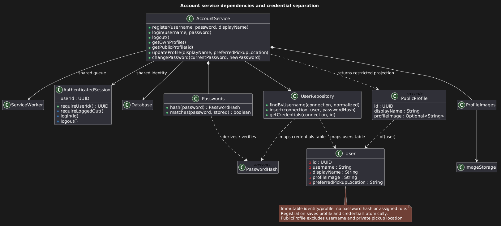
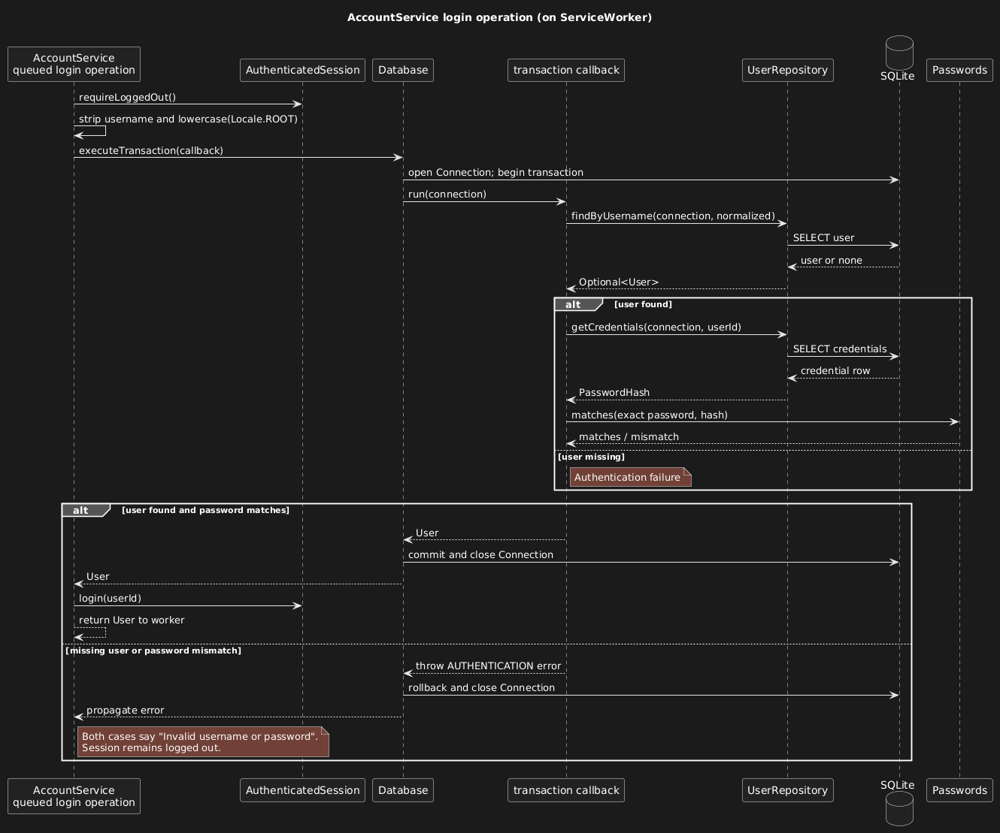

## Account Service and Local Persistence

### Runtime lifecycle and data directory

`ApplicationRuntime.open(Path)` owns the application data-directory lock, schema
migration, image recovery, shared service worker, and all six services. Close it to
drain queued work before releasing the lock. `Main.init` opens the runtime off the
JavaFX thread; `Main.stop` closes it. Initialization failures show an error instead
of resetting storage. Runtime data defaults to `${user.home}/.hotshop`; override it
for development with `-Dhotshop.dataDir=/absolute/path` before `-jar`, for example:

```powershell
java "-Dhotshop.dataDir=C:\HotShop-test-data" -jar release/HotShop.jar
```

The current Gradle `run` task does not forward this system property to its
application JVM. The default Windows folder is normally `%USERPROFILE%\.hotshop`.
For an intentional clean test dataset, close the app, back up any data to retain,
and delete the selected data folder; the next launch initializes an empty one.

### SQLite storage and transactions

SQLite JDBC 3.53.4.0 is the only new library. The bundled driver supplies SQLite;
no server or separately installed SQLite executable is needed. Tests enable native
access just like the launcher. The runtime directory contains `marketplace.db`,
`application.lock`, `images/profiles/`, and `images/listings/`.

`Database.executeTransaction` opens a connection with foreign keys and a 5000 ms busy
timeout, then commits or rolls back the callback. Pass that same connection to
every repository participating in a business operation. `UserRepository` maps
profiles and separate `PasswordHash` records; it does not authorize callers.

### Schema versions

Schema version 1 lives in `src/main/resources/db/migration/001_accounts.sql`.
Version 2 (`002_listings.sql`) adds `listings` and `listing_images` and rebuilds
`image_cleanup` with a `namespace` column, tagging existing rows as `profiles`.
Version 3 (`003_offers.sql`) adds `offers`, with a partial unique index allowing
one pending offer per buyer and listing, and `transactions`, with a partial
unique index allowing one active sale per listing. Version 4
(`004_sale_completion.sql`) adds `cancelled_at` and `cancelled_by` to
`transactions` and a `cancellation_requests` table with a partial unique index
allowing one pending request per sale. `Transaction`'s internal `lastEventAt` is
not stored; `restore` derives it from the saved times. Requests are saved with an
upsert and read back in the order they were made, so the latest is always last.
Version 5 (`005_meetups.sql`) adds `meetup_slots`, `meetups`, and
`meetup_reschedule_proposals`, with partial unique indexes allowing one scheduled
meetup per sale and one pending move proposal per meetup.
Version 6 (`006_conversations.sql`) adds `conversations` (unique per listing and
buyer, with each participant's read position and last-opened time) and
`messages` (unique per conversation and sequence number). It also creates a
conversation for every buyer and listing that already had offers, marked as
opened by both at the latest offer event so old offers don't show as unread.
Before the Chat-Service branch was rebased onto MeetupService, this migration
ran as version 5; delete any local database created from that branch then.

### Schema migrations

`Database.migrate` runs at every startup. It reads the database's highest
recorded version from `schema_migrations`, then applies each later migration
in order, each in its own transaction together with its version record. A
failure therefore leaves the database at the last fully applied version, and
the next startup retries from there. A database whose version is higher than
the application knows is refused rather than downgraded.

#### Adding a migration

To change the schema:

1. Add `src/main/resources/db/migration/NNN_description.sql`, numbered one
   above the latest file.
2. Append its resource path to `Database.MIGRATIONS`. A migration's version is
   its one-based position in that list, so only ever append.
3. Add tests that open a database created at the previous version and check
   that existing data survives the upgrade.

Never edit or reorder a migration that has been merged, and never reset an
existing database; change the schema with a new migration instead. If both
teammates add a migration on separate branches, whoever merges second
renumbers theirs. Statements are split on `;`, so migrations must not contain
triggers or semicolons inside string literals or comments.

#### Migration verification

`DatabaseTest` supplies its own migration files from
`src/test/resources/db/test-migration/` through a package-private constructor,
so runner tests do not depend on the released schema.

### Account operations and authentication

#### Service API and error handling

AccountService returns `CompletableFuture` results. Its public operations are
`register`, `login`, `logout`, `getCurrentUserId`, `getOwnProfile`, `getPublicProfile`,
`updateProfile`, `changePassword`, `replaceProfileImage`, and `removeProfileImage`.
`recoverImages` is a lifecycle maintenance operation. Access the service through
`ApplicationRuntime.getAccounts()`. `ServiceException.getCode()` distinguishes
validation, authentication, session, duplicate username, not-found, storage,
permission, and invalid-state failures for every service; a joined future wraps
the exception in `CompletionException`.

#### Shared session and worker integration

Future services must share the same `ServiceWorker`, `AuthenticatedSession`, and
`Database` when wired into ApplicationRuntime. Resolve acting identity inside the
queued operation, not when a controller submits it. The session contains only
the UUID; profile reads use the latest persisted record. PublicProfile includes
only ID, display name, and optional image filename. Private pickup preferences
and credential records must never be passed to another user's profile screen.
Callbacks may execute on the service worker; marshal UI updates using
`Platform.runLater`. Do not block that worker by joining another service call or
closing the runtime from a completion callback. Closing belongs to the lifecycle
owner. Cancelling a returned future does not cancel an already queued mutation.

[](../diagrams/accounts_uml.png)

#### Password storage and login

Passwords use PBKDF2-HMAC-SHA256, a fresh 16-byte salt, 600,000 iterations, and a
256-bit derived key, with algorithm/work-factor metadata persisted separately.
Password strings are not normalized or stripped. No password/hash is returned
through a profile. A local database is not protection against someone who can
modify the application's data files; there is no remote authentication server.

The login sequence shows credential verification inside the database transaction
and session establishment only after successful verification.

[](../diagrams/login_uml.png)

### Image storage and recovery

ImageStorage accepts per-feature limits and validates actual JPEG/PNG contents,
dimensions, and bounded bytes before writing a generated filename. `ManagedImages`
owns one image namespace (a folder, its limits, a "still referenced" query, and
its rows in the durable `image_cleanup` queue). It imports files, queues retired
files inside the caller's transaction, and recovers orphans. `ProfileImages` and
`ListingService` each configure one (`profiles` and `listings`), so recovery in
one namespace never processes or deletes the other's files. Cleanup rechecks
database references and retries failed removals at startup. A new image feature
should add a namespace to the `image_cleanup` CHECK constraint in a migration
and construct its own `ManagedImages`. SQL fixtures/triggers
in tests inject persistence failures at the external database boundary; assertions
check service-visible results and managed-file lifecycle.
