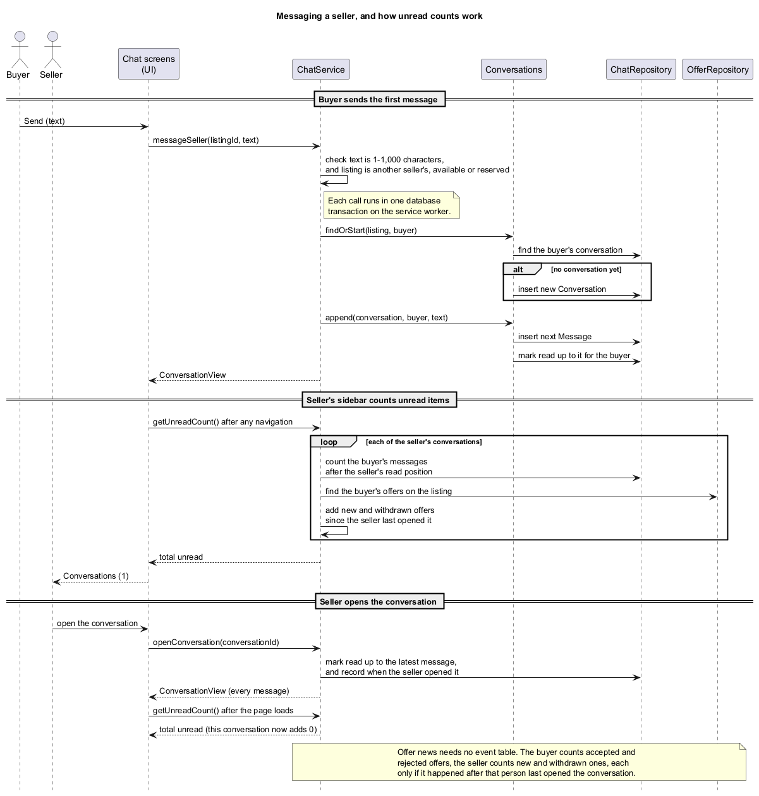

## Chat Service

`ChatService` manages persistent conversations between buyers and sellers. Its responsibilities include conversation and message persistence, access control, unread-state calculation, conversation retrieval and ordering, and exposing references to related offers and transactions.

The service uses SQLite for persistence and operates on behalf of the currently authenticated user.

[ChatService Design](../ChatServiceDesign.html) records the agreed requirements.

### Design

A conversation is uniquely associated with:

* one listing;
* the seller of that listing; and
* one prospective buyer.

There is at most one conversation for each `(listing, buyer)` pair. Existing conversations are reused rather than duplicated.

Conversation creation is lazy when initiated through messaging: opening a chat does not persist a conversation until the first message is sent.

`OfferService` can also create or reuse a conversation when an offer is submitted. Conversation creation and offer submission occur within the same database transaction to maintain consistency between the two services.

Only participants of a conversation may access its contents.

### Service access and operations

Access it through `ApplicationRuntime.getChats()`. Every operation requires
login. Only the buyer starts a conversation, by messaging the seller or by
making an offer; only the buyer and seller can read it.

| Operation | Who | Rule |
| --- | --- | --- |
| `messageSeller(listingId, text)` | Buyer | Another seller's available or reserved listing. Starts the conversation or adds to it. |
| `sendMessage(conversationId, text)` | Either participant | While the listing is available or reserved; sold and archived listings are read-only. |
| `openConversation(conversationId)` | Either participant | Returns every message and marks them read. |
| `openChatWithSeller(listingId)` | Buyer | The existing conversation, opened, or empty when there is none yet. |
| `openChatWithBuyer(listingId, buyerId)` | The listing's seller | An existing conversation only; sellers never start one. |
| `getConversations()` | Anyone | `ConversationSummary` list: pending offer or active sale first, then the rest; unread first, then latest activity. |
| `getUnreadCount()` | Anyone | Total unread items, for the sidebar. |

### Messages and unread counts

Messages are 1-1,000 characters after trimming. A conversation's unread count
is the other participant's messages after the viewer's read position plus
offer events since the viewer last opened it: new and withdrawn offers for the
seller, accepted and rejected ones for the buyer, each offer counted once. These
are worked out from the offers' own times, so no event table is needed.

### Conversation summaries and transaction integration

`ConversationSummary` also carries the buyer's latest offer, the active sale
between the two (so the screen can ask MeetupService for the meetup), a preview,
and whether sending is allowed. `Conversations` is the package-private helper
that ChatService and OfferService use to start conversations and add messages
inside their own transactions. There are no automatic messages.

### Service Boundaries

`ChatService` deliberately does not implement offer, transaction, or meetup state transitions.

Offer actions exposed alongside a conversation are delegated to `OfferService`. This keeps offer validation and state-transition logic in a single service.

A conversation exposes the buyer's relevant offer information and the ID of any active sale associated with the `(listing, buyer)` pair. Other components can use this information to obtain additional transaction or meetup data from their respective services.

In particular, meetup information is obtained through `MeetupService`; `ChatService` does not depend directly on meetup implementation details.

Sale, offer, and meetup events are not persisted as artificial chat messages. Their current state is retrieved from the corresponding domain services instead.

### Unread-State Calculation

Unread state includes both persisted messages and relevant offer events.

Messages use the participant's conversation read state to determine whether they are unread.

Offer events do not require a separate event table. They are derived from each offer's creation and closing timestamps relative to the participant's last-opened timestamp.

This design avoids duplicating offer state inside the chat subsystem.

Sending a message is treated as opening the conversation for the sender and therefore advances the sender's read state.

For offer events, only events caused by the other participant are considered unread. For example, an offer that a seller personally accepts or rejects is not subsequently considered unread for that seller.

How a buyer's first message reaches the seller, and how opening the
conversation clears its unread count:

### Conversation Retrieval and Ordering

`getConversations()` divides conversations into two groups:

1. Conversations associated with a pending offer or active sale.
2. All remaining conversations.

Within each group, conversations with unread activity are returned first, followed by conversations ordered by their latest activity.

Latest activity considers both messages and offer state changes.

Conversation previews are similarly derived from the latest message or offer event. If a message and offer event have identical timestamps, the message takes precedence.

When determining the offer associated with a conversation, a pending offer takes precedence. If no pending offer exists, the buyer's newest offer is used. This prevents ambiguous ordering when an offer is withdrawn and another is created at the same timestamp.

### Listing Lifecycle

Conversation write access depends on the state of the associated listing.

Messages can be persisted while a listing is `AVAILABLE` or `RESERVED`. Conversations associated with `SOLD` or `ARCHIVED` listings remain accessible but are treated as read-only.

If cancellation changes a listing from `RESERVED` back to `AVAILABLE`, the existing conversation becomes writable again rather than requiring a new conversation.

Deleting a listing also deletes enquiry-only conversations and their messages within the same database transaction.

Listings with offer history are already protected from deletion by the listing-domain rules, so this deletion behaviour only applies to conversations containing enquiries without offer history.

### Persistence

Chat data is persisted in SQLite.

Migration `006_conversations.sql` introduces the persistence structures required by `ChatService`.

The migration also creates conversations for offers that existed before the chat subsystem was introduced. This preserves the invariant that every offer has a corresponding conversation.

Backfilled conversations are marked as opened by both participants at the latest existing offer event. Without this step, migrating an existing database would incorrectly cause historical offers to appear as unread.

Operations spanning multiple domain objects are atomic where required. In particular:

* offer submission and conversation creation occur in one database transaction; and
* listing deletion and deletion of its enquiry conversations occur in one database transaction.

### Error Handling

`ChatService` uses the shared `ServiceException` mechanism.

| Error | Meaning |
| --- | --- |
| `VALIDATION` | Invalid message input, such as blank or overlong text. |
| `NOT_FOUND` | A required conversation, listing, or related entity cannot be found. |
| `PERMISSION` | The authenticated user is not permitted to access or perform the operation. |
| `INVALID_STATE` | The relevant domain object exists but its current state does not permit the operation. |

The distinction between `PERMISSION` and `INVALID_STATE` is intentional: permissions describe **who may perform an operation**, while state errors describe **whether the operation is currently valid**.

### Testing

`ChatService` is tested using JUnit 5 with temporary SQLite databases.

Tests focus on:

* conversation uniqueness and reuse;
* transactional conversation creation through `OfferService`;
* participant access control;
* message validation and ordering;
* listing-state transitions affecting message write access;
* unread-state calculations for messages and offer events;
* conversation grouping, ordering, and preview generation;
* integration with offer and transaction state;
* atomic listing/conversation deletion;
* persistence across application restarts; and
* migration and backfilling of conversations for existing offers.
