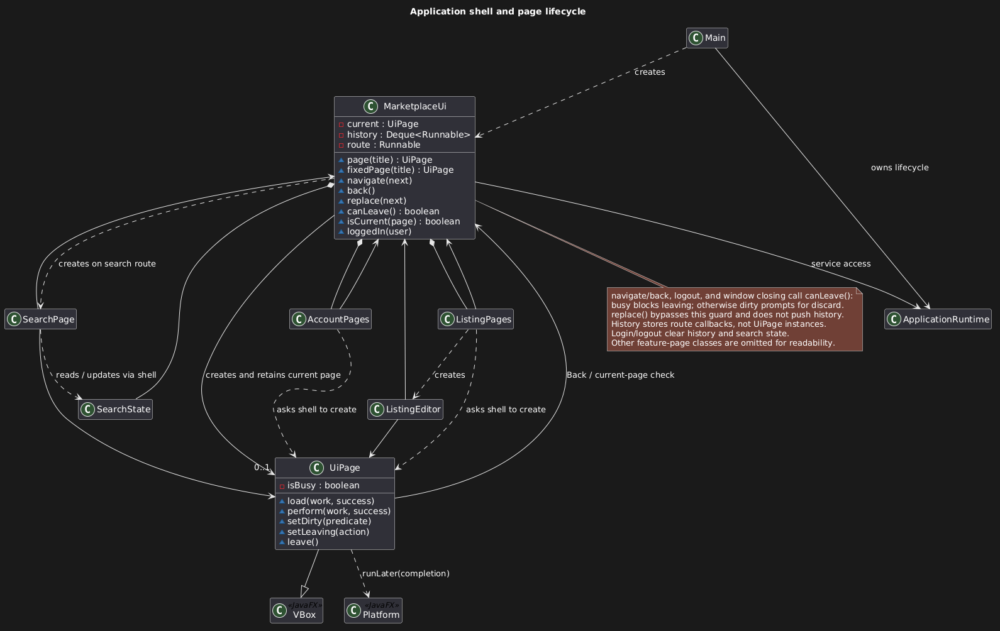

## JavaFX UI

### Application Shell

`MarketplaceUi` installs the scene, grouped sidebar, navigation
history, session reset, and unsaved-change guards. Feature page classes construct
JavaFX controls programmatically; the old welcome-only FXML resource was removed.
No new library is required.

### Shared Styling and Listing Cards

The shared `hotshop/styles.css` defines the warm light palette and shadow-free
control states. Form and confirmation dialogs attach the same stylesheet to their
dialog panes; the startup-error dialog also uses it. Keep popup and keyboard-focus
styles consistent when adding controls. `ListingCards` fixes buyer cards at
240 x 304 and My Listings cards at 240 x 432 layout units, preserving the
208 x 130 image frame and 52-unit title area. The wrapping grid changes
column count instead of stretching cards. Existing owner-listing responses supply
the status and pending-offer footer, while buyer cards show condition.
Chat unread badges, offer-bar borders, and message bubbles reuse the shared
palette variables so conversation screens stay consistent with the theme.

### Asynchronous Operations and Navigation Guards

`UiPage` owns loading, duplicate-submission protection, retry, and safe error
display. It uses service futures and `Platform.runLater`; it never blocks the FX
thread on a service future. Page callbacks verify that their page is still current.
Service operations run through the shared [ServiceWorker](#service-worker). Screens use
services exclusively, and service permissions remain authoritative. Confirmation
dialogs are closed before business operations start; no database transaction waits
for user input.

`UiPage.load` offers Retry after an asynchronous failure; `perform` does not
automatically offer to repeat a mutation. Both ignore duplicate submissions while
busy, disable the page body, and schedule completion handling through
`Platform.runLater`. Once back on the FX thread, the page checks
`MarketplaceUi.isCurrent` before rendering. `MarketplaceUi.canLeave` blocks
navigation while busy and asks for confirmation if the page's dirty predicate is
true. Listing editors include photo order in that predicate; profile text and
conversation drafts supply their own predicates.

---

### Search State

`SearchState` separates submitted criteria from draft controls and retains raw
unfinished price text and scroll position across navigation. Sort changes apply
to submitted results; refresh does not submit draft edits. Session changes clear
search and navigation history. A collapsible Filters panel keeps results reachable
at the minimum window size.

---

### Chat Screens

#### Conversation Layout and Drafts

[Chat Screens Design](ChatScreensDesign.md) records the agreed layout and
behaviour. `ChatPages` holds the Conversations list and the entry points
(`withSeller`, `withBuyer`, and opening from the list). `ConversationPage` is one
conversation: header, offer bar, messages, and send box. It keeps its `TextArea`
across reloads, so a draft survives offer actions, and marks itself dirty while
the draft is not blank. It is the only page built with `MarketplaceUi.fixedPage`,
which is not wrapped in the page scroll pane: `UiPage.fillHeight` lets the body
take the remaining height, and only the message list scrolls, with a 200 px
minimum. `UiPage.setHeadingExtras` places controls on the title's row.

#### Offer Actions and Conversation Grouping

`OfferBar` is a pure record that maps the viewer's role, the latest offer, the
listing status, and the sale status to the bar's text and `OfferBar.Action`s, so
its rules are tested without JavaFX (`OfferBarTest`). The actions call
OfferService through `OfferPages.makeOffer` and `OfferPages.accept`, which the
listing page also uses. `ConversationSummary` carries only an active sale's ID,
so for an accepted offer without one the page finds the sale's status in
`getMySales` or `getMyPurchases`, as `SalePages.forOffer` does. The list's two
groups use `ConversationSummary.isAboutOfferOrSale`, which ChatService also
orders by, so the screen never restates that rule.

#### Loading Order and Unread Counts

`UiPage.load` ignores a call while another load runs, so a page that needs two
loads chains the second inside the first's success callback. Listing details
does this when "Chat with seller" must check `getConversations` for a closed
listing; it deliberately avoids `openChatWithSeller`, which marks a conversation
read. `MarketplaceUi` refreshes the sidebar's unread total after every
navigation. The single service worker runs that count after the page load just
queued, so a conversation the new page opens is already counted as read.

---

### Meetup Screens

#### Meetup State and Formatting

[Meetup Screens Design](MeetupScreensDesign.md) records the agreed behaviour.
The conversation keeps one fixed bar for the latest stage of the deal:
`MeetupBar.replacesOfferBar` decides that an active or completed sale shows the
meetup bar instead of the offer bar. `MeetupBar` is a pure record, like
`OfferBar`: it maps the viewer's role, the `MeetupSummary`, the sale status, and
the current time to the bar's text and `MeetupBar.Action`s, and provides
`summary` (the one line on sale and listing entries) and `format` (weekday,
24-hour clock). A meetup counts as past once its end is no longer after now,
matching `SaleProgress`. Both take a `ZoneId`, so `MeetupBarTest` does not depend
on the machine's time zone.

#### Shared Limits and Controls

The screens read the meetup limits from their owners rather than copying them:
`MeetupService.MAX_OFFERED_SLOTS`, `MeetupService.MAX_DAYS_AHEAD`, and
`MeetupTime.MAX_LOCATION_LENGTH`. The offer bar uses `UiControls.bar`; the
meetup bar uses a wrapping summary and action row in `MeetupPages`.

#### Dialogs and Sale Integration

`MeetupPages` builds the bar and owns the dialogs: the time dialog (date picker
limited to today through 60 days ahead, 15-minute start times, fixed lengths,
place) and the offered-times list with Book or Withdraw. Every action calls
MeetupService and then reloads the conversation. For an active sale the page
loads `getMeetupSummary`; for a completed sale it uses the `MeetupSummary` on the
matching `SaleForParticipant`. Sale Details shows the bar's text for an active
sale; My Sales and My Purchases show
`MeetupBar.summary`; and the Dashboard shows
`SalesDashboard.upcomingMeetups`. There is no separate meetup page, so the old
"Meetups" and "Availability & Meetups" sidebar entries are gone.

#### Meetup Details on Listing Cards

Seller cards reserve a 120-unit meetup area below the status/offer-count footer,
so a seller card is the compact card's height plus that area and its gap
(`ListingCards.SELLER_CARD_HEIGHT`). `ListingCards` reads the existing
`MeetupSummary` directly and shows booked dates (two lines overnight), 24-hour
times, and a 40-unit two-line place label. Only the place can truncate. The date
and time text comes from `MeetupBar.dates` and `MeetupBar.clockRange`, so cards,
sales, and the conversation bar format meetups in one place. The grid computes
row height from its fixed-size children. Colours shared across the stylesheet are
`-hotshop-*` tokens defined on `.root`.

---

### Keyboard Navigation

`ChatPages` gives each conversation card a focusable body with Enter/Space
activation and a plain title. View Listing and profile buttons remain separate
focus targets; the body's event handlers exclude descendant buttons. Both
conversation groups share this presentation and retain service ordering.

### Responsive Sale Layouts

`SalePages` places item context and sale progress in a `GridPane`. At 720 units of
available content width the groups use equal columns; below that they stack.
The enclosing page scrolls, preserving all sale actions and confirmation flows.
The navigation ScrollPane fits its content to height while retaining the links'
preferred minimum height for scrolling, and its viewport has a white background.
The conversation's meetup bar places its wrapping full summary above a wrapping
action row, so long places do not truncate the summary or the action buttons.

### Public Listings and Image Access

`ListingService.getPublicListings(UUID)` requires login and returns only the
selected user's available listings, newest first, with restricted public-profile
data. Missing users return NOT_FOUND; null IDs return VALIDATION. It reuses the
existing seller query, with no schema changes. `ApplicationRuntime` exposes bounded
image-path resolution for presentation; `ImageStorage.validateImage` lets the
picker validate without importing, while saving revalidates and imports as before.

### UI Verification

UI tests use JUnit 5 and actual JavaFX controls backed by temporary SQLite data.
They require a graphical desktop; on headless Linux, install Xvfb and JavaFX's GTK
runtime libraries and run `xvfb-run -a ./gradlew test`. CI uses Xvfb. Run the screen
journeys alone with `.\gradlew.bat test --tests hotshop.ui.MarketplaceUiTest`, or
the offer and meetup bar rules with `--tests hotshop.ui.OfferBarTest --tests
hotshop.ui.MeetupBarTest`.
The tests also write scene snapshots to ignored `build/ui-checks/` for visual
inspection. Window defaults are 1100 x 750, minimum 960 x 640, in JavaFX units.
