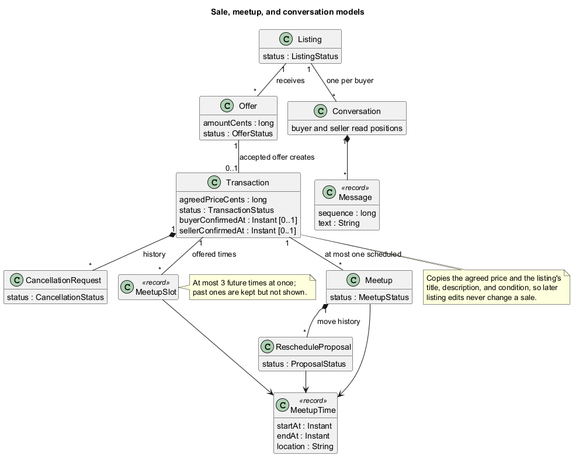

## Marketplace Services

Five services carry the marketplace rules: ListingService, OfferService,
TransactionService (sales), MeetupService, and ChatService. Each is reached
through `ApplicationRuntime` (`getListings()`, `getOffers()`, `getTransactions()`,
`getMeetups()`, `getChats()`), shares the one `ServiceWorker` (see [Service Worker](ServiceWorker.html)),
database, and session, and follows the same pattern:

- Every operation requires login and acts as the session's current user.
  Screens never pass a user ID, so a screen cannot act for someone else.
- Each change runs in one database transaction. It loads the records, checks
  who may act and what state allows, applies the change through the model, and
  saves every affected record before committing. Any failure rolls the whole
  change back.
- Refusals are `ServiceException`s whose codes say why (`VALIDATION`,
  `NOT_FOUND`, `PERMISSION`, `INVALID_STATE`, `SESSION`, `STORAGE`) and whose
  messages say what to do, with real values, never SQL. Tests assert the code
  and key values, not exact wording.
- Results are detached copies, often paired with public profiles
  (`ListingWithSeller`, `SaleForParticipant`, `ConversationSummary`), so screens
  cannot change stored state by accident.

`ServiceSupport` holds the plumbing these five share: the current time
truncated to SQLite's milliseconds, transaction error mapping, public-profile
lookup, status words, price formatting (`S$40.00`), and message times on a
24-hour clock. Small package-private helpers let one service change another's
records inside its own transaction, without queueing more work on the single
worker: `PendingOffers` (reject a listing's pending offers), `SaleMeetups`
(load and close a sale's meetup), and `Conversations` (start a conversation and
add messages).

The models behind these services, and how they refer to each other:

Records refer to each other by ID rather than holding each other, so each can
be loaded and saved on its own. A sale (`Transaction`) copies the agreed price
and the listing's title, description, and condition, so a later listing edit
never changes it. `MeetupTime` is one value for a start, end, and place,
validated once (15 minutes to 4 hours, a 1-200 character place) and shared by
offered times, meetups, and move proposals.

### Testing the services

Service tests open a real `ApplicationRuntime` on a temporary folder with a
`TestClock` (`ApplicationRuntime.open(Path, Clock)`), so they use the real
database, worker, and repositories, and time only moves when a test advances it.
Some listing tests set a listing's status in SQL to reach reserved or sold states
directly; offer, sale, meetup, and chat tests use the real services.

The targeted test commands for each service are listed in the
[Developer Guide](../DeveloperGuide.html#development-verification).
