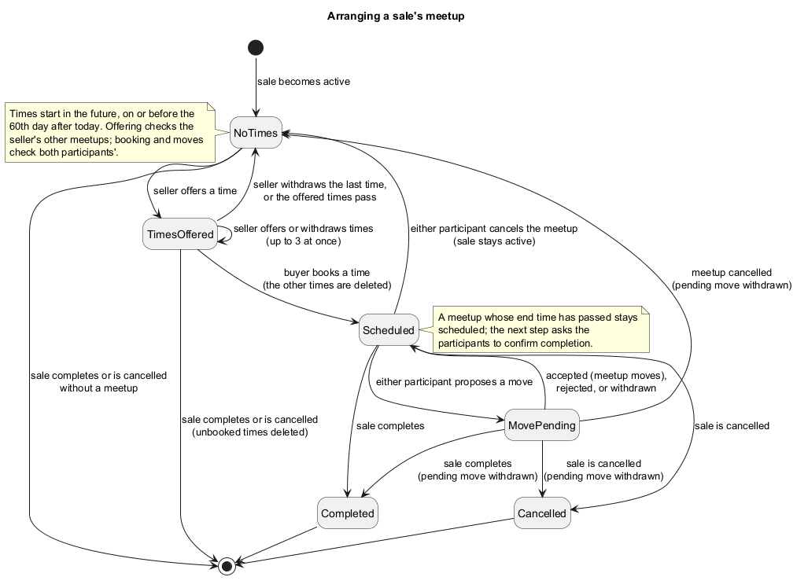

## Meetup Service

`MeetupService` manages meetup scheduling for marketplace transactions. It is responsible for seller-provided meetup slots, meetup booking, rescheduling proposals, cancellation, scheduling conflict detection, and persistence.

Meetup data is persisted using SQLite and is associated with active sales managed by `TransactionService`.

### Design

Meetups belong to sales rather than directly to listings or users. A sale may have at most one scheduled meetup at a time.

Completed and cancelled meetups are retained in persistent storage as historical records.

Meetup scheduling consists of two related concepts:

* **Meetup slots** — possible times and locations offered by a seller for a specific sale.
* **Meetups** — a scheduled arrangement created when the buyer books one of those slots.

Slots are specific to a `(seller, buyer, sale)` relationship rather than representing global seller availability, so booking one can safely delete the rest. The same time can be offered to two buyers, and the first to book gets it.

[MeetupService Design](../MeetupServiceDesign.html) records the agreed requirements.
How a sale's meetup moves from offered times to a booked meetup, and how the
sale's outcome closes it:

[](../diagrams/meetup_state_uml.png)

### Access, time limits, and clocks

Access it through `ApplicationRuntime.getMeetups()`. Every operation requires
login and only the sale's participants may act. Times are `MeetupTime` values:
15 minutes to 4 hours long, a 1-200 character location, starting in the future
and on or before the 60th calendar day after today (`MAX_DAYS_AHEAD`). Calendar
days and the times in refusal messages use the services' clock zone; the
production clock is `Clock.systemDefaultZone()`, so they match the screens, and
tests use a fixed UTC `TestClock`.

### Operations and permissions

| Operation | Rule |
| --- | --- |
| `offerSlot(saleId, start, end, location)` | Seller of an active sale with no booked meetup. At most 3 future slots; they cannot overlap each other or the seller's scheduled meetups. |
| `withdrawSlot(slotId)` | Seller of the slot's sale. |
| `bookSlot(slotId)` | Buyer of the sale, for a future slot. Neither participant may have another scheduled meetup at an overlapping time, in any role. The sale's other slots are deleted. |
| `proposeMove(meetupId, start, end, location)` | Either participant, when no move is pending. Overlaps are checked as for booking. |
| `acceptMove` / `rejectMove(meetupId)` | The participant who did not propose. Accepting rechecks overlaps and moves the meetup. |
| `withdrawMove(meetupId)` | The participant who proposed. |
| `cancelMeetup(meetupId)` | Either participant. The sale stays active and the seller can offer new slots. |
| `getMeetupSummary(saleId)` | `MeetupSummary`: future offered slots and the current meetup (scheduled, else the completed one). Cancelled meetups are kept in the database as history but not returned. |

### Service Boundaries

`MeetupService` owns meetup scheduling rules, conflict detection, slots, and rescheduling proposals.

`TransactionService` remains responsible for transaction lifecycle changes. When a transaction is completed or cancelled, it completes or cancels the sale's meetup through the package-private `SaleMeetups` helper, as part of the surrounding database transaction, rather than calling `MeetupService`.

This allows meetup state to remain consistent with transaction state without duplicating transaction rules inside `MeetupService`.

Other services and presentation components can obtain meetup information for a sale through:

```text
getMeetupSummary(saleId)
```

The summary exposes the relevant meetup state without requiring callers to reconstruct it directly from persistence.

Cancelled meetups remain persisted for historical purposes but are excluded from the standard meetup summary.

### Sale summaries and progress

The same summary is carried by `SaleForParticipant`, by reserved entries in
`OwnListing`, and counted in `SalesDashboard.upcomingMeetups` (the seller's
scheduled meetups that have not started). `SaleMeetups` is the package-private
helper that loads summaries and closes a sale's meetup for TransactionService.
`SaleProgress` puts cancellation requests and the viewer's own confirmation ahead
of meetup steps; a meetup counts as past once its end time has passed.

### Error Handling

`MeetupService` uses the shared `ServiceException` mechanism.

| Error | Meaning |
| --- | --- |
| `VALIDATION` | Invalid times, durations, locations, or slot limits. |
| `NOT_FOUND` | The requested sale, slot, meetup, or proposal cannot be found. |
| `PERMISSION` | The authenticated user is not permitted to perform the requested meetup operation. |
| `INVALID_STATE` | The required entity exists but its current state prevents the operation, such as an inactive sale, unavailable slot, scheduling conflict, or non-pending proposal. |

Scheduling conflicts are represented as `INVALID_STATE` because the supplied scheduling data may be valid in isolation but cannot be applied given the current persisted meetup state.

### Testing

`MeetupService` is tested using JUnit 5 with temporary SQLite databases and controlled time sources.

Tests focus on:

* time, duration, location, and scheduling-boundary validation;
* slot limits and overlap detection;
* participant conflict detection across buyer and seller roles;
* atomic booking and removal of unused slots;
* competing bookings for overlapping times;
* rescheduling proposal creation, acceptance, rejection, and withdrawal;
* conflict revalidation when accepting rescheduling proposals;
* meetup cancellation and subsequent rebooking;
* propagation of transaction completion and cancellation to meetup state;
* handling of past and in-progress meetups;
* persistence across application restarts; and
* database migration from existing schemas.
