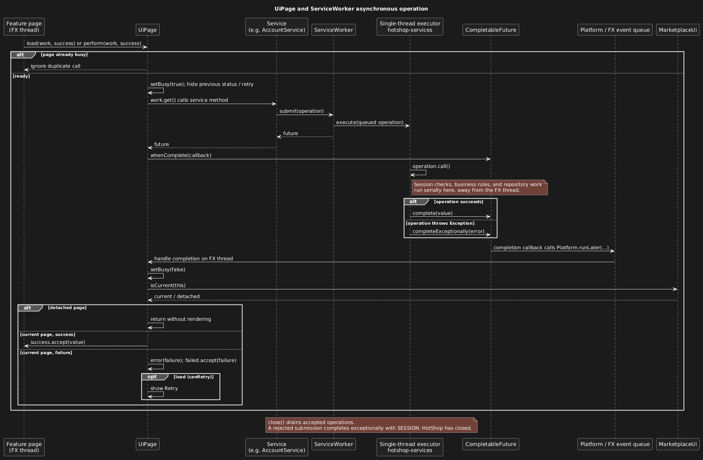

## Service worker

### Worker ownership and responsibilities

`ServiceWorker` serializes service operations away from the JavaFX application
thread. `ApplicationRuntime` creates one worker and supplies it to all six
services, together with the shared `AuthenticatedSession`. The worker owns a
single-thread executor named `hotshop-services`; it does not contain business
rules or manage database transactions. Services perform validation and permission
checks inside their submitted operations and use `Database` for commit/rollback.

### Submission and execution

1. A service passes a `Callable<T>` to `submit`. The worker creates a
   `CompletableFuture<T>`, queues the callable, and returns the future without
   waiting for the operation to finish.
2. The executor runs accepted operations one at a time. Session reads and changes
   use this same queue. For example, a profile update queued before logout checks
   and uses the logged-in identity before logout clears it.
3. When the callable returns, the worker completes its future with the result.
   If it throws an `Exception`, the worker completes that future exceptionally;
   the failure does not prevent subsequent queued operations from running.

#### Queue ordering and transaction boundaries

Queue ordering prevents service operations from overlapping, but does not replace
database transactions: a service must still group related writes atomically.
Keep operations short, since a slow operation delays every service behind it.
Never wait for user input inside an operation.

### Completion and UI handoff

The following sequence follows a UI request through the service queue and back
to the page. `UiPage` handles presentation; `ServiceWorker` only executes the
callable and completes its future.

Completion callbacks can run on the service worker. `UiPage` therefore uses
`Platform.runLater` to handle the result on the FX thread, clears its busy state,
and checks that it is still the current page before displaying a result or error.
The worker itself never updates controls or retries an operation. The page offers
Retry for a failed load; it does not automatically repeat a mutation.

#### Callback safety and cancellation

Do not call `join()` or otherwise wait for another service operation from a
worker callback: the queued operation cannot run until the current work releases
the worker. Do not close the runtime from that callback either. Cancelling the
returned future does not remove or interrupt its queued callable, so cancellation
must not be treated as undoing a write.

### Shutdown

`ServiceWorker.close()` closes the executor and waits for accepted operations to
finish. `ApplicationRuntime.close()` does this before releasing the data-directory
lock, so a second instance cannot open the directory while accepted work is still
running. Shutdown belongs to the application lifecycle owner. A submission
rejected by the closed executor returns a future completed exceptionally with
`ServiceException.Code.SESSION` and the message "HotShop has closed".

#### Lifecycle verification

Existing tests cover session queue ordering in
`AccountServiceTest.updateProfile_queuedBeforeLogout_usesIdentityInQueueOrder`
and draining/rejection in
`ApplicationRuntimeTest.close_queuedRegistration_drainsWorkAndRejectsNewOperations`.
