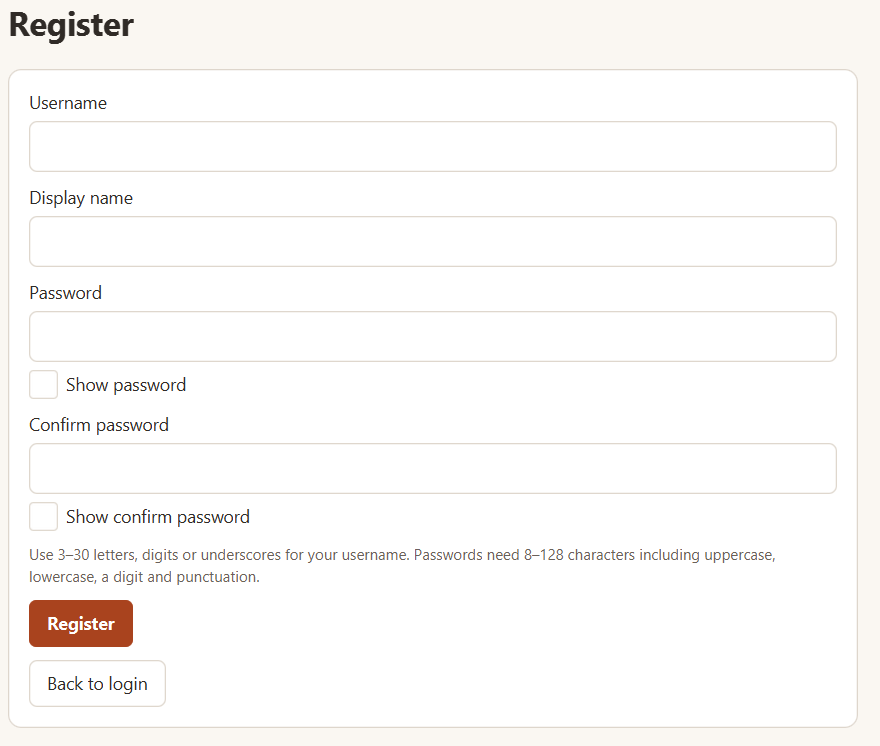

## Accounts and navigation

### Registering and logging in

[]

Choose **Create an account** to register with a username, display name, password,
and password confirmation, then choose **Register**. Registration returns to
login with your username filled in and the message "Account created. Log in to
continue." **Back to login** leaves registration without creating an account.
On the login page, choose **Log in** or press Enter in the password field while
**Show password** is unchecked to submit. Usernames are case-insensitive and
surrounding whitespace is trimmed at login; passwords retain their exact case
and whitespace. Password visibility
checkboxes let you inspect what you typed.

### Navigating the app

After login, the Search page opens. Every user can both buy and sell; the sidebar's
Buying and Selling headings organise pages and do not switch account roles.
The white navigation column fills the window height. In shorter windows, scroll
within it to reach the remaining links.

### Managing profiles and passwords

Use **My Profile** to save your display name and private preferred pickup location.
Your username cannot be changed. **Replace Image** and **Remove Image** save
separately from the text fields. **Change Password** requires your current password
and matching new passwords; it keeps you logged in. Clicking another participant's
name/photo opens **Public Profile** with their available listings, newest first.
If they have none, it shows "No available listings". Your own identity link opens
My Profile instead.

### Going back, logging out, and unsaved changes

Use **Back** to return through pages and **Log out** to end the session. Leaving a
listing editor with changed fields or added, removed, or reordered photos asks
whether to discard them. Unsaved profile text has the same protection, including
on logout and closing the window. Choose **Discard Changes** to leave without
saving, or **Cancel** to keep editing. Wait for an active operation to finish
before navigating or closing.

## Feedback and unfinished features

### Validation and loading feedback

Forms retain input after errors and show field-specific validation where possible.
Loading indicators show work in progress and prevent repeat submissions. Routine
profile and password saves use inline success messages. Empty collections explain
what to do next, such as creating a listing or searching for items.

### Checking for updates

HotShop does not send notifications. To see what's new, check each sale's next
step in My Sales or My Purchases, your offers in My Offers, the pending-offer
counts in My Listings and on the Dashboard, and the unread counts on
Conversations.

### Unavailable features

The wishlist has no screens yet. Its navigation entry and the listing page's
**Save to wishlist** button are disabled and labelled **Coming soon**. They do not
open placeholder feature screens.
