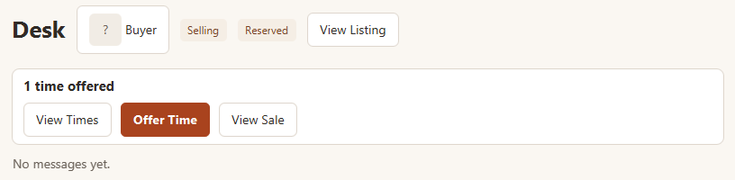

## Meetups

### Arranging and managing a meetup

You arrange where and when to hand over the item inside the sale's conversation;
there is no separate meetup page. Open the conversation with **Open Chat** on the
sale, or from **Conversations**. During an active sale, the bar at the top of the
conversation shows the meetup:

1. **The seller offers times.** Choose **Offer Time** and pick a date (today to the
   60th day after today), a start time (in 15-minute steps), a length (15, 30, or
   45 minutes, or 1, 1.5, 2, 3, or 4 hours), and a place. The form starts at
   tomorrow 12:00 for 30 minutes at the listing's pickup location. Each **Offer
   Time** adds one time; you can offer up to 3, after which **Offer Time** is no
   longer shown. **View Times** lists them, each with **Withdraw**.
2. **The buyer chooses one.** The buyer sees "n times offered" and **Choose Time**,
   which lists the times, each with **Book**. Booking removes the other times.
3. **Once booked**, the bar shows the time and place, for example "Meetup: Fri 2 Oct
   2026, 14:00 to 14:30 · Library lobby". Either of you can:
   - **Propose Move**: the same form, starting from the current meetup. The other
     person sees your proposal with **Accept Move** and **Reject Move**; you see it
     with **Withdraw Proposal**. While a proposal is pending, **Propose Move** and
     **Cancel Meetup** are hidden for both of you.
   - **Cancel Meetup**: asks you to confirm. The sale stays active, and the seller
     can offer new times.

*The seller's meetup bar after offering one time. The buyer sees **Choose Time**
instead.*

### Completion and scheduling errors

Once the meetup's end time has passed, the bar asks you to confirm completion on
the sale if the handover happened, with **View Sale**; **Propose Move** and
**Cancel Meetup** are no longer shown. (A move proposal that is still pending
keeps showing its own buttons until it is answered or withdrawn.) Completing the
sale shows "Sale completed · Met on ..." in the bar. If a time can't be offered
or booked (for example, it has already started or overlaps another of your
meetups), the reason appears and nothing changes.

### Finding meetup details

The meetup also appears on each active sale in **My Sales** and **My
Purchases**, and on reserved listings in **My Listings**, for example "2 times
offered" or "No meetup times yet". A sale's **Sale Details** page shows the same
text as the conversation's bar. Completed sales that had a meetup show where you
met ("Met on ...").
Booked meetups show the date and time, including both dates for an overnight
meetup. Long places may end with an ellipsis; open the sale or its conversation
for full details.

**Sale Details** groups the item, agreed price, and other participant on the left
and status, meetup, and actions on the right. Narrow windows stack these sections;
scroll down to reach all information and actions.

For every meetup limit and rule, see
[Meetups](MarketplaceRules.html#meetups) in the Marketplace rules.

